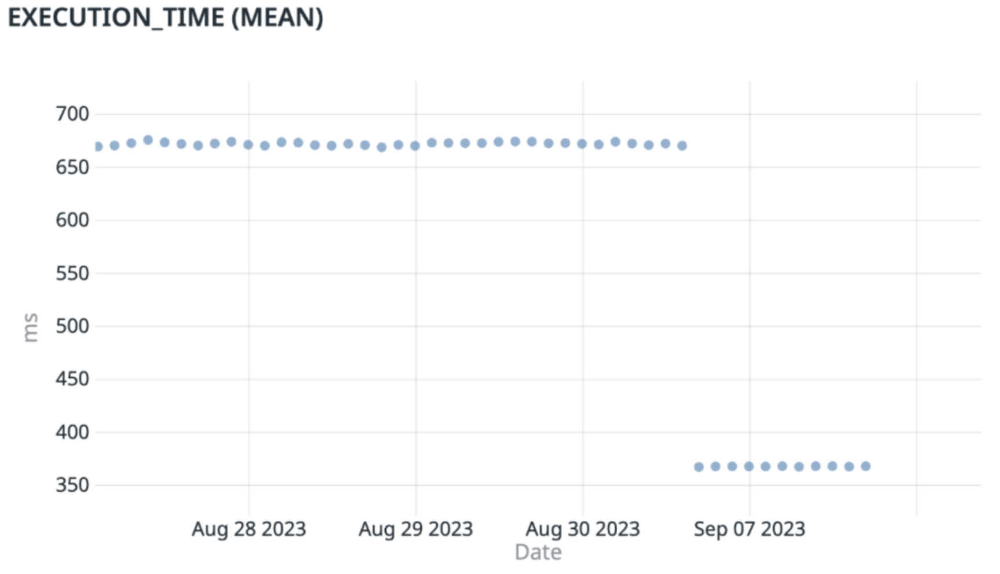
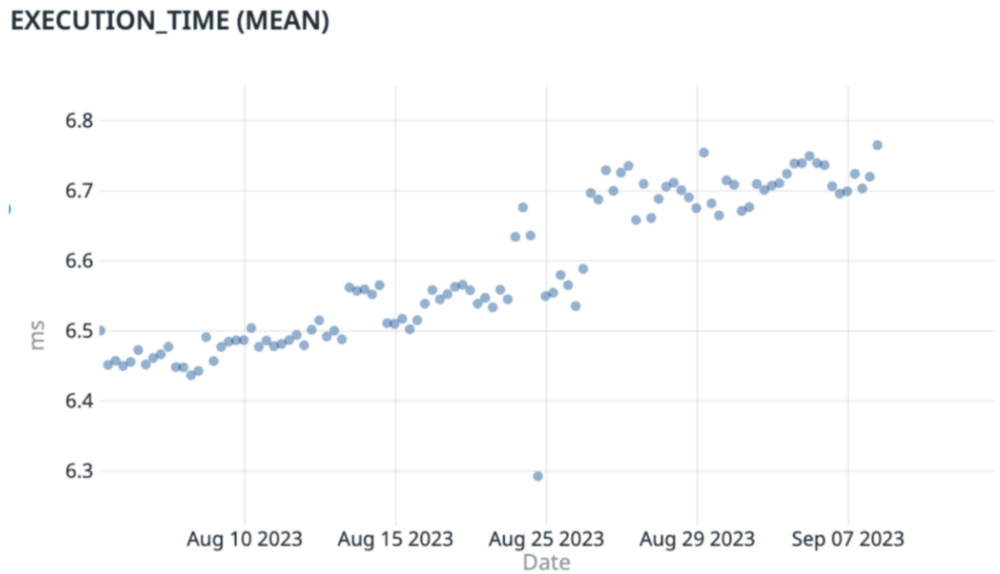
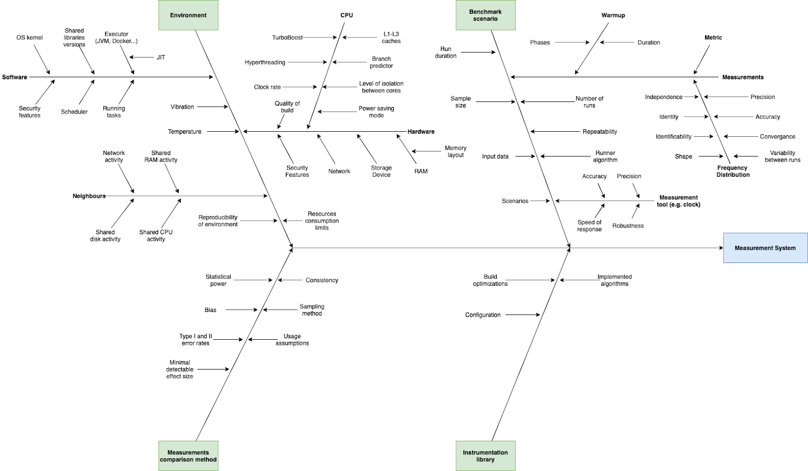

--- 
marp: true
theme: default
math: mathjax

# columns usage: https://github.com/orgs/marp-team/discussions/192#discussioncomment-1516155
style: |
    .columns {
        display: grid;
        grid-template-columns: repeat(2, minmax(0, 1fr));
        gap: 1rem;
    }
    .comment {
        color: #888;
    }
---

# How to Reliably Measure Software Performance

Augusto de Oliveira, Kemal Akkoyun

FOSDEM 2026

---

*[Lingchi, usually translated as "death by a thousand cuts"](https://en.wikipedia.org/wiki/Lingchi)*

_TODO: Refine analogy to create a strong start. Here we want to describe how performance degradation accumulates gradually as code is added to a project. As a conclusion, we must be able to have systems in place to detect even very small changes in performance._

---

*What we usually expect when thinking of performance changes*

*What we usually have*

_TODO: This slide drives the "death by a thousand cuts" point home. Update the images with more recent examples, and include two examples of performance degradation (currently, the first one is actually a performance improvement)_

---

TODO: Clean up diagram, make point evident. This slide presents the problem at hand, which is that measuring performance reliably is hard. There are many factors that impact performance, and it is difficult to control them all.

--- 

1. **Making performance tests reliable**
   1. Controlling environmental noise
   2. Using load testers effectively
   3. Interpreting results correctly

2. **Integrating performance tests into your workflow**
   - Practical strategies for development teams

---

# Part 1
## Making Performance Tests Reliable

---

## Controlling Environmental Noise: Performance Tweaks

TODO: Here we show the performance tweaks we do for benchmarking and why. They include: pinning CPU frequencies, preventing CPUs from sleeping when idle, setting processor scaling governors to "performance", dedicating cores to system-specific processes, disabling hyperthreading, disabling turbo-boost, enforcing specific CPU models.

Split into multiple slides, and add code snippets.

---

## Controlling Environmental Noise: Benchmarking Best Practices

TODO: General concepts around benchmarking:

- Differences around micro and macrobenchmark
- How to write good benchmarks (What number of runs? What number of iterations? What should you benchmark?), 
- How to check if they're good (Coefficient of variation? False positive rate?)

Look at our own documentation and enrich this section.

---

## Using Load Testers Effectively: Coordinated Omission

TODO: What the coordinated omission problem is and how to avoid it.

---

## Using Load Testers Effectively: What Load Testers to Use

TODO: What load testers to use for different use cases (vegeta, k6, wrk2, etc.)

---

## Using Load Testers Effectively: Building Representative Workloads

TODO: How to use load test plans and how to build representative workloads (What payloads to send? At what rate?)

---

## Interpreting Results: General Concepts

TODO: Some general concepts about statistics we need:
- What is a normal distribution?
- What is a confidence interval?
- What is a sample size?
- What is a false positive rate? Why are false positive rates _always_ present in any kind of statistical test? What can you do about it?

Maybe:
- What is a normality test?
- What is a p-value?
- What is a t-test?

---

## Interpreting Results: Using Confidence Intervals

TODO: Here we drive the discussion forward about confidence intervals, since they are the most relevant concept the audience needs to understand.

---

# Part 2
## Integrating Tests Into Your Workflow

---

TODO: Share our experience integrating performance tests into our development workflow:
- CI/CD
- Quality gates
- Operational excellence reviews

Maybe include discussions around cultural shifts required to make performance testing a natural part of the development process.

---

# Thank you!

TODO: Refine. Thank you, questions, references, contact information.

--- 
