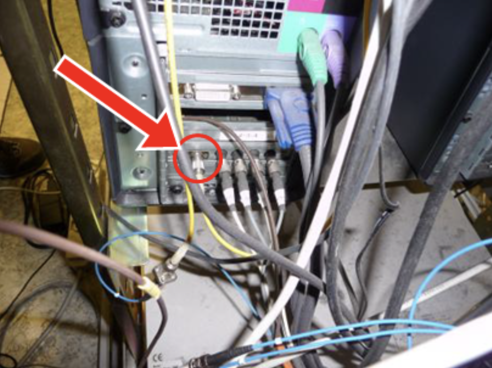

Slides roughly reflect the structure we're aiming to follow, but `outline.md` is a more complete document outlining the presentation.

---

# How to Reliably Measure Software Performance

Augusto de Oliveira, Kemal Akkoyun

FOSDEM 2026

---

*Lingchi - "death by a thousand cuts"*

---

## Agenda

1. How to control your benchmarking environment
2. How to design your benchmarks
3. How to interpret benchmark results
4. How to integrate benchmarks into your workflows

---

*The OPERA neutrino detector*

---

*The loose fiber optic cable that caused the measurement error*

---

# Controlling the Environment

---

Controlling the Environment

## Sources of Noise

- Memory layout
- Non-determinism in compilation and linking
- Non-determinism in available resources on colocated logical cores
- Network instability
- Scheduler latency
- Vibration
- Variable clock rate
- Build quality of cores
- CPU power saving mechanisms
- CPU overheating prevention mechanisms

---

Controlling the Environment

## System Tweaks

**Purpose:** Show practical system tweaks for benchmarking and how to implement them.

Content to add:
- Pin CPU frequency to 2.5 GHz (prevents frequency scaling)
- Prevent Intel CPUs from sleeping when idle (max_cstate=1)
- Set CPU scaling governor to "performance" mode
- Dedicate 4 CPUs exclusively for system workloads
- Disable Intel P-state driver (revert to ACPI frequency scaling)
- Disable hyperthreading/SMT on physical cores
- Disable Intel Turbo Boost feature

Include code snippets from the GitLab runner config.

---

Controlling the Environment

## Before and After

*Effect of controlling environmental noise on benchmark stability*

**Purpose:** Show visual comparison of benchmark results before and after controlling environmental noise.

---

# Benchmark Design

---

Benchmark Design

**TODO:** Segway to the benchmark design section with an analogy or story.

---

## Some Terminology

Benchmark Design

*Diagram: Benchmarking harness (load generator) → System under test*

---

## Some Terminology

**System under test:** What is being measured
**Harness:** What measures it
- **Operations:** Single execution
- **Iterations:** Batch of operations measured together
- **Repetitions:** Number of times you run the harness

**TODO:** Concrete examples for each of the above.

---

## What Makes Up a Benchmark?

Benchmark Design

*micro benchmarks (single functions) vs macro benchmarks (full systems)*

**Purpose:** Simple visual explanation of what benchmarks are, plus a difference between micro and macro benchmarks.

---

## What Makes a Good Benchmark?

- Repeatability 
- Representativeness
- Consistency
- Robustness

**TODO:** Concrete examples for each of the above.

---

## How to Get Your Benchmarks to a Good State

- Use realistic scenarios and data that match production usage
- Run sufficient sample sizes: **30+ iterations, 10+ repetitions**
- Include warm-up time for JIT-compiled languages
- Use dedicated, isolated hardware (avoid shared/cloud runners)
- Measure variability: aim for **Coefficient of Variation < 2%**
- Use load generators that avoid the coordinated omission problem

**TODO:** Maybe split into different slides with more in-depth explanations and concrete examples for each.

---

# Interpreting Benchmark Results

---

## The Naive Approach Isn't Enough

*Two noisy signals with different means but insufficient statistical difference*

- **TODO:** Maybe remove the title for this slide to make the image more impactful.

---

*Highly overlapping histograms*

*Clearly different histograms*

**Purpose:** Show the intuition behind hypothesis testing.

---

# Integrating Benchmarks Into Your Workflows

---

*Architecture diagram with highlighted integration points: CI/CD, quality gates, operational excellence reviews, competitor benchmarks*

**Purpose:** Show the overall benchmarking platform architecture and how it integrates with development workflows.

---

## Real-Life Example

**Purpose:** Showcase a real-life example to thread through the integration workflows.

**TODO:** decide on specific example, include real numbers and graphs, show concrete benefits.

We're going to have a slide for each highlighted box in the benchmarking platform architecture diagram, referring to the example and including real numbers and graphs to bring the point home.

---

# Concluding slides

**TODO:** Conclusion (summarizing the takeaways), thank you/questions, contact information, references.

