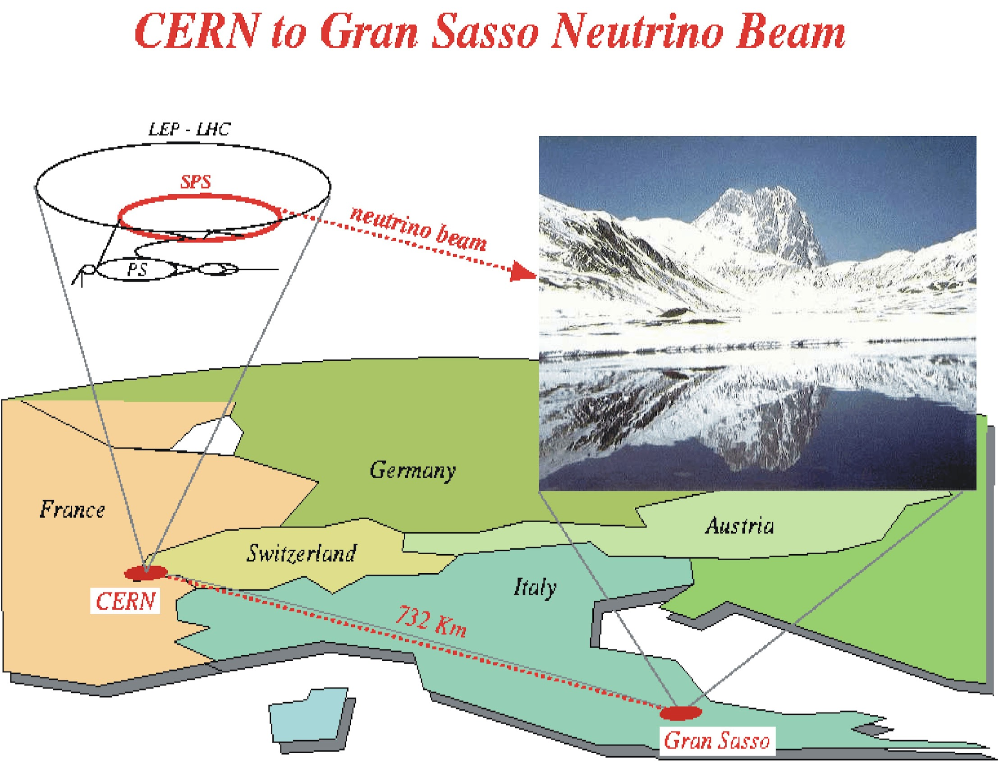
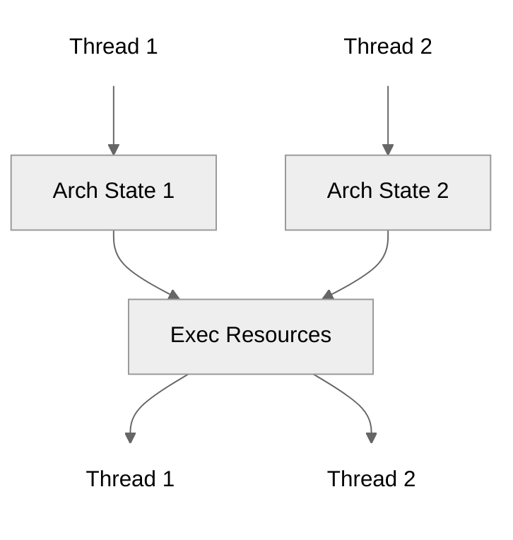
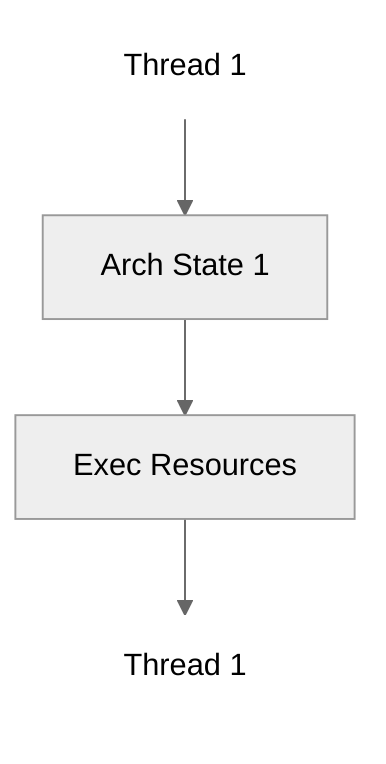
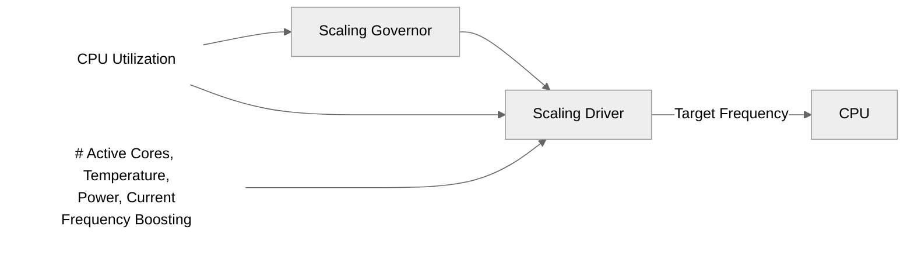

# How to Reliably Measure Software Performance

Augusto de Oliveira, Kemal Akkoyun

FOSDEM 2026

<!-- ---

<center>


*[Lingchi](https://en.wikipedia.org/wiki/Lingchi), or "death by a thousand cuts"*

</center> -->

---

<!-- paginate: true -->

<center>



*732 km neutrino beam path from CERN in Geneva to Gran Sasso \[1\]*

</center>

---

<center>


</center>

---

<center>

<span class="big">100 M€</span> \[2\]

</center>

---

<center>


*Loose fiber optic cable that caused the measurement error \[3\]*

</center>

---

How to:

1. Control your benchmarking environment
2. Design your benchmarks
3. Interpret benchmark results
4. Integrate benchmarks into your workflows

---

# How to control your benchmarking environment

---

<!-- header: "How to control your benchmarking environment" -->

<div class="centered-table">

| Layer       | Noise Sources                      | Mitigations|
|-------------|------------------------------------|------------|
| External    | Network<br>Temperature<br>Vibration    | Use dedicated hardware |
| Application | Memory layout<br>Compilation/linking | Set up fixed builds (e.g., disable ASLR)|
| Kernel      | Filesystem cache<br>Scheduling | Set CPU affinity<br>Set process priority<br>Warm up or drop caches|
| CPU         | Simultaneous multithreading (SMT) contention<br>Dynamic frequency scaling (DFS) | Disable SMT<br>Disable DFS |

</div>

---

<div class="centered-table">

| Layer       | Noise Sources                      | Mitigations|
|-------------|------------------------------------|------------|
| External    | Network<br>Temperature<br>Vibration    | Use dedicated hardware |
| Application | Memory layout<br>Compilation/linking | Set up fixed builds (e.g., disable ASLR)|
| Kernel      | Filesystem cache<br>Scheduling | <span class="hl">Set CPU affinity<br>Set process priority<br>Warm up or drop caches</span>|
| CPU         | Simultaneous multithreading (SMT) contention<br>Dynamic frequency scaling (DFS) | <span class="hl">Disable SMT<br>Disable DFS</span> |

</div>

<div class="bottom-citation">

*Bakhvalov, "Performance Analysis and Tuning on Modern CPUs", Appendix A*

</div>

---

```bash
# Set CPU affinity
taskset -c 0 ./benchmark

# Increase process priority
nice -n -5 ./benchmark

# Drop filesystem cache
echo 3 > /proc/sys/vm/drop_caches && sync

# Disable Simultaneous Multithreading (SMT)
echo off > /sys/devices/system/cpu/smt/control

# Disable Dynamic Frequency Scaling (DFS) (Turbo Boost on Intel CPUs)
echo 1 > /sys/devices/system/cpu/intel_pstate/no_turbo

# Pin clock rate to base frequency
echo 2500000 > /sys/devices/system/cpu/cpu*/cpufreq/scaling_min_freq
echo 2500000 > /sys/devices/system/cpu/cpu*/cpufreq/scaling_max_freq

# Set scaling governor to "performance"
echo performance > /sys/devices/system/cpu/cpu*/cpufreq/scaling_governor
```

<center>

*Bakhvalov, "Performance Analysis and Tuning on Modern CPUs", Appendix A*

</center>

---

## What's the impact of disabling SMT?

<div class="columns">

<div>
<center>


```mermaid
%%{init: {'theme': 'neutral'}}%%

graph TB
    T1[Thread 1] --> AS1["Arch State 1"]
    T2[Thread 2] --> AS2["Arch State 2"]
    AS1 --> E["Exec Resources"]
    AS2 --> E
    E --> O1[Thread 1]
    E --> O2[Thread 2]
    style T1 fill:none,stroke:none
    style T2 fill:none,stroke:none
    style O1 fill:none,stroke:none
    style O2 fill:none,stroke:none
```

*SMT enabled: hardware threads compete for resources*

</center>
</div>

<div>
<center>


```mermaid
%%{init: {'theme': 'neutral'}}%%

graph TB
    T1[Thread 1] --> AS1["Arch State 1"]
    AS1 --> E1["Exec Resources"]
    E1 --> O1[Thread 1]
    style T1 fill:none,stroke:none
    style O1 fill:none,stroke:none
```

*SMT disabled: hardware thread has exclusive access to resources*

</center>
</div>

</div>

---

## What's the impact of disabling SMT?

<center>

m5.metal, clock rate pinned, scaling governor set to "performance"
**2 CPU-intensive tasks on same core (smt) vs. separate cores (no-smt)**

</center>

<div class="columns">

<div>

<center>


</center>

</div>

<!-- To align with the graph's borders -->
<div style="padding-top: 43px;">

| Thread | mean ± stddev | coeff. of variation |
|--------|---------------|----------------------|
| smt-1 | 1537.64 ± 367.29 ms | 23.887 % |
| smt-2 | 1536.88 ± 366.84 ms | 23.869 % |
| no-smt-1 | 737.37 ± 0.32 ms | 0.044 % |
| no-smt-2 | 737.93 ± 1.74 ms | 0.235 % |

</div>

</div>

---

## What's the impact of disabling SMT?

<center>

m5.metal, clock rate pinned, scaling governor set to "performance"
**2 CPU-intensive tasks on same core (smt) vs. separate cores (no-smt)**

</center>

<div class="columns">

<div>

<center>


</center>

</div>

<!-- To align with the graph's borders -->
<div style="padding-top: 43px;">

| Thread | mean ± stddev | coeff. of variation |
|--------|---------------|----------------------|
| smt-1 | 1537.64 ± 367.29 ms | <span class="hl">23.887 %</span> |
| smt-2 | 1536.88 ± 366.84 ms | <span class="hl">23.869 %</span> |
| no-smt-1 | 737.37 ± 0.32 ms | <span class="hl">0.044 %</span> |
| no-smt-2 | 737.93 ± 1.74 ms | <span class="hl">0.235 %</span> |

</div>

</div>

<div style="transform: translateY(-30px);">

<center>

**<span class="hl">100x less variation</span>**

</center>

</div>

---

## What's the impact of disabling DFS?

<center>


```mermaid
%%{init: {'theme': 'neutral'}}%%

graph LR
    Load["CPU Utilization"] --> Gov["Scaling Governor"]
    Gov --> Driver["Scaling Driver"]
    Load --> Driver
    Physical[# Active Cores, Temperature,<br>Power, Current<br>Frequency Boosting] ---> Driver
    Driver -- "Target Frequency" --> CPU

    style Load fill:none,stroke:none
    style Physical fill:none,stroke:none
```

</center>

---

## What's the impact of disabling DFS?

<center>

m5.metal, SMT disabled
**Varying number of CPU-intensive tasks on the same core with DFS on vs. off**

</center>

<div class="columns">

<div>

<center>


</center>

</div>

<div style="padding-top: 35px;">

| Thread | mean ± stddev | coeff. of variation |
|--------|---------------|----------------------|
| dfs-1 | 533.97 ± 2.046 ms | 0.383 % |
| dfs-8 | 578.67 ± 0.287 ms | 0.050 % |
| no-dfs-1 | 738.18 ± 0.306 ms | 0.041 % |
| no-dfs-8 | 739.18 ± 0.351 ms | 0.047 % |

</div>

</div>

---

## What's the impact of disabling DFS?

<center>

m5.metal, SMT disabled
**Varying number of CPU-intensive tasks on the same core with DFS on vs. off**

</center>

<div class="columns">

<div>

<center>


</center>

</div>

<div style="padding-top: 35px;">

| Thread | mean ± stddev | coeff. of variation |
|--------|---------------|----------------------|
| dfs-1 | <span class="hl">533.97</span> ± 2.046 ms | <span class="hl">0.383 %</span> |
| dfs-8 | <span class="hl">578.67</span> ± 0.287 ms | 0.050 % |
| no-dfs-1 | 738.18 ± 0.306 ms | <span class="hl">0.041 %</span> |
| no-dfs-8 | 739.18 ± 0.351 ms | 0.047 % |

</div>

</div>

<div style="transform: translateY(-30px);">

<center>

**<span class="hl">10x less variation</span>**
**<span class="hl">Removes dynamic frequency scaling as a source of noise</span>**

</center>

</div>

---

<!-- header: "" -->

# How to design benchmarks

---

<!-- header: "How to design benchmarks" -->

<center>

*"All happy families are alike; each unhappy family is unhappy in its own way."*

— Leo Tolstoy, *Anna Karenina*

</center>

---

<center>

*"All happy <span class="replace"><span class="old">families</span><span class="new">benchmarks</span></span> are alike; each unhappy <span class="replace"><span class="old">family</span><span class="new">benchmark</span></span> is unhappy in its own way."*

</center>

---

<center>

<span class="medium">**representative** and **repeatable**</span>

</center>

---

<div class="section-header">How to design benchmarks</div>

## An unhappy benchmark

- Goal: Measuring performance overhead caused by instrumenting a Spring app with dd-trace-java.

---

## An unhappy benchmark

- Goal: Measuring performance overhead caused by instrumenting a Spring app with dd-trace-java.
- System under test: Spring Petclinic instrumented (or not) with dd-trace-java.

---

## An unhappy benchmark

- Goal: Measuring performance overhead caused by instrumenting a Spring app with dd-trace-java.
- System under test: Spring Petclinic instrumented (or not) with dd-trace-java.
- Workload: As many requests as possible by 5 concurrent users.

---

## An unhappy benchmark

- Goal: Measuring performance overhead caused by instrumenting a Spring app with dd-trace-java.
- System under test: Spring Petclinic instrumented (or not) with dd-trace-java.
- Workload: As many requests as possible by 5 concurrent users.
- 20 second warmup, 15 seconds of actual measurements.

---

<center>


Many **false positives**, unnacceptably **high CoV** (= standard deviation / mean) of 11.80%.

</center>

---

<center>


Many **false positives**, unnacceptably **high CoV** (= standard deviation / mean) of 11.80%.

Are we running the benchmark long enough?

</center>

---

<center>


</center>

---

<center>


**Tip #1: Run benchmarks for longer to uncover perturbations (e.g., warmup effects).**

</center>

---

<center>


**Tip #1: Run benchmarks for longer to uncover perturbations (e.g., warmup effects).**

For how long should we run the benchmark?

</center>

---

<div class="columns">

<div>


</div>

<div style="padding-top: 100px;">
<div class="centered-table">

| # measurements | CoV |
|----------------|-----|
| 30 | 6.95% |
| 60 | 5.23% |
| 90 | 4.59% |

</div>
</div>

</div>

---

<div class="columns">

<div>


</div>

<div style="padding-top: 100px;">
<div class="centered-table">

| # measurements | CoV |
|----------------|-----|
| 30 | 6.95% |
| 60 | 5.23% |
| 90 | 4.59% |

</div>
</div>

</div>

<center>

**Tip #2: Collect enough samples to reduce intra-run variation.**

</center>

---

<div class="columns">

<div>


</div>

<div style="padding-top: 100px;">
<div class="centered-table">

| # measurements | CoV |
|----------------|-----|
| 30 | 6.95% |
| 60 | 5.23% |
| 90 | 4.59% |

</div>
</div>

</div>

<center>

**Tip #2: Collect enough samples to reduce intra-run variation.**
But what about inter-run variation?

</center>

---

<center>


*Impact of initial state on FFT benchmark results \[4\]*

</center>

---

<center>


</center>

---

<center>


</center>

---

<div class="columns">

<div>

<center>


</center>

</div>

<div style="padding-top: 45px;">

<div class="centered-table">

| Run # | mean ± stddev | CoV |
|------|---------------|-----|
| 1 | 20.08 ± 0.63 ms | 3.16% |
| 2 | 20.63 ± 0.56 ms | 2.72% |
| 3 | 20.31 ± 0.45 ms | 2.23% |
| 4 | 20.19 ± 0.54 ms | 2.66% |
| 5 | 20.26 ± 0.63 ms | 3.11% |
| all | 20.29 ± 0.60 ms | 2.94% |

</div>

</div>

</div>

---

<div class="columns">

<div>

<center>


</center>

</div>

<div style="padding-top: 45px;">

<div class="centered-table">

| Run # | mean ± stddev | CoV |
|------|---------------|-----|
| 1 | 20.08 ± 0.63 ms | 3.16% |
| 2 | 20.63 ± 0.56 ms | 2.72% |
| 3 | 20.31 ± 0.45 ms | 2.23% |
| 4 | 20.19 ± 0.54 ms | 2.66% |
| 5 | 20.26 ± 0.63 ms | 3.11% |
| all | 20.29 ± 0.60 ms | 2.94% |

</div>

</div>

</div>

<center>

**Tip #3: Rerun benchmarks multiple times to reduce inter-run variation.**

</center>

---

Tip #1: Run benchmarks for longer to uncover perturbations (e.g., warmup effects).

Tip #2: Collect enough samples to reduce intra-run variation.

Tip #3: Rerun benchmarks multiple times to reduce inter-run variation.

<br>

<center>

CoV: 11.80% → **2.94%**

</center>

---

Tip #1: Run benchmarks for longer to uncover perturbations (e.g., warmup effects).

Tip #2: Collect enough samples to reduce intra-run variation.

Tip #3: Rerun benchmarks multiple times to reduce inter-run variation.

<br>

<center>

CoV: 11.80% → **2.94%**

</center>

<br>

**Tip #4: Use deterministic seeds, avoid non-deterministic inputs.**

---

Tip #1: Run benchmarks for longer to uncover perturbations (e.g., warmup effects).

Tip #2: Collect enough samples to reduce intra-run variation.

Tip #3: Rerun benchmarks multiple times to reduce inter-run variation.

<br>

<center>

CoV: 11.80% → **2.94%**

</center>

<br>

Tip #4: Use deterministic inputs.

**Tip #5: Use load generators that avoid the coordinated omission problem.**

---

Tip #1: Run benchmarks for longer to uncover perturbations (e.g., warmup effects).

Tip #2: Collect enough samples to reduce intra-run variation.

Tip #3: Rerun benchmarks multiple times to reduce inter-run variation.

<br>

<center>

CoV: 11.80% → **2.94%**

</center>

<br>

Tip #4: Use deterministic inputs.

Tip #5: Use load generators that avoid the coordinated omission problem.

<center>

**But what about inter-experiment variation?**

</center>

---

Tip #1: Run benchmarks for longer to uncover perturbations (e.g., warmup effects).

Tip #2: Collect enough samples to reduce intra-run variation.

Tip #3: Rerun benchmarks multiple times to reduce inter-run variation.

<br>

<center>

CoV: 11.80% → **2.94%**

</center>

<br>

Tip #4: Use deterministic inputs.

Tip #5: Use load generators that avoid the coordinated omission problem.

<center>

But what about inter-experiment variation?

</center>

**Tip #0: Control your benchmarking environment.**

---

# Interpreting Benchmark Results

---

<span class="comment">
Emphasize that simply comparing means or percentiles is not enough. Statistical methods such as t-tests are absolutely necessary to draw meaningful conclusions.

Shout out to Henrik Ingo's talk on changepoint detection.
</span>

---

# Integrating Benchmarks Into Your Workflows

---

<span class="comment">
A series of screenshots showing the different ways in which we integrate benchmarks into our workflows at Datadog, including: a basic architecture slide, reporting capabilities, PR comments, performance quality gates, operational excellence reviews, etc.
</span>

---

# Concluding slides

<span class="comment">

Summarize the takeaways.

</span>

---

<style scoped>
p { font-size: 0.5em; line-height: 1.4; }
</style>

# References

\[1\] Universität Münster. "Neutrino oscillations in the neutrino beam from CERN to Gran Sasso." <https://www.uni-muenster.de/Physik.KP/en/AGFrekers/forschung/opera.html>. Accessed Jan 2026.
\[2\] CERN. (1999). "From Geneva to Gran Sasso in 2.5 milliseconds!". <https://home.cern/news/press-release/cern/geneva-gran-sasso-25-milliseconds>. Accessed Jan 2026.
\[3\] Strassler, M. (2012). "OPERA: What Went Wrong." <https://profmattstrassler.com/articles-and-posts/particle-physics-basics/neutrinos/neutrinos-faster-than-light/opera-what-went-wrong/>. Accessed Jan 2026.
\[4\] Kalibera, T., Bulej, L., and Tuma, P. (2005). "Benchmark Precision and Random Initial State." In *Proceedings of the International Symposium on Performance Evaluation of Computer and Telecommunication Systems (SPECTS)*, pages 182-196. SCS.
\[5\] Bakhvalov, D. (2024). *Performance Analysis and Tuning on Modern CPUs*. <https://www.amazon.com/Performance-Analysis-Tuning-Modern-CPUs/dp/B0DMVQ1QDD>. Accessed Jan 2026.
\[6\] Valles, A. (2009). "Performance Insights to Intel Hyper-Threading Technology." <https://web.archive.org/web/20150217050949/https://software.intel.com/en-us/articles/performance-insights-to-intel-hyper-threading-technology/>. Accessed Jan 2026.
\[7\] Gregg, B. (2014). "Frequency Trails: Outliers." <https://www.brendangregg.com/FrequencyTrails/outliers.html#Causes>. Accessed Jan 2026.
\[8\] Gregg, B. (2020). "Systems Performance: Enterprise and the Cloud.", p. 233, "P-states and C-states."
\[9\] Humenay, E., Tarjan, D., and Skadron, K. (2007). "Impact of Process Variations on Multicore Performance Symmetry."
\[10\] Linux Kernel Documentation. "CPUFreq Governors." <https://www.kernel.org/doc/Documentation/cpu-freq/governors.txt>. Accessed Jan 2026.
\[11\] ArchWiki. "CPU frequency scaling." <https://wiki.archlinux.org/title/CPU_frequency_scaling>. Accessed Jan 2026.
\[12\] Intel. "Intel Server Board and System Products Update on Intel Turbo Boost Technology Support with Low Power Intel Xeon Processor 3400/5500/5600 Series." https://cdrdv2-public.intel.com/840590/white_paper_turbo_boost_on_low_power_processor.pdf. Accessed Jan 2026.
