<!-- _class: vcenter invert -->

# How to Reliably Measure Software Performance

Augusto de Oliveira, Kemal Akkoyun

FOSDEM 2026

---

<!-- paginate: true -->
<!-- _class: vcenter -->

<center>


</center>

---

<!-- _class: vcenter -->

<center>

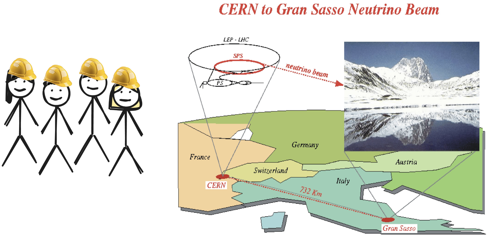

_\[1\]_

</center>

---

<!-- _class: vcenter -->

<center>

<div class="big">
5 years

~€100M 💸

</div>

`[2, 3]`

</center>

---

<!-- _class: vcenter -->

<center>

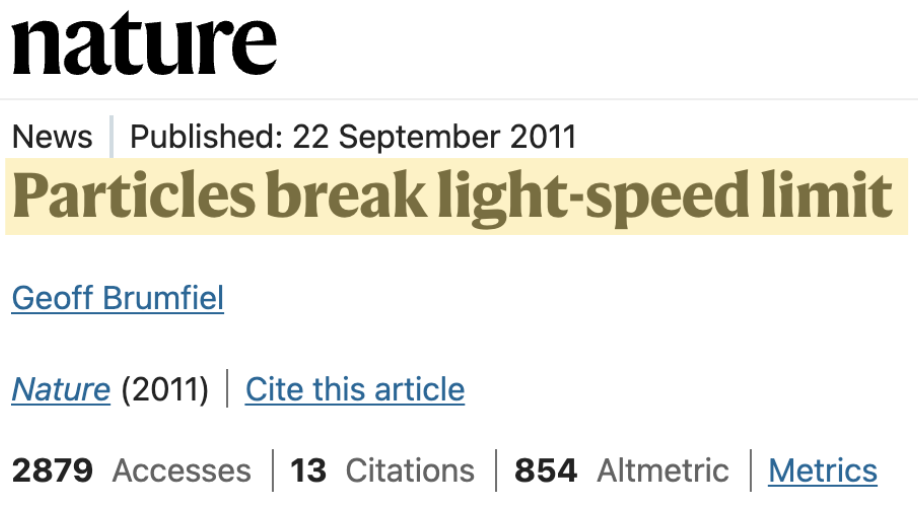

</center>

---

<!-- _class: vcenter -->

<center>

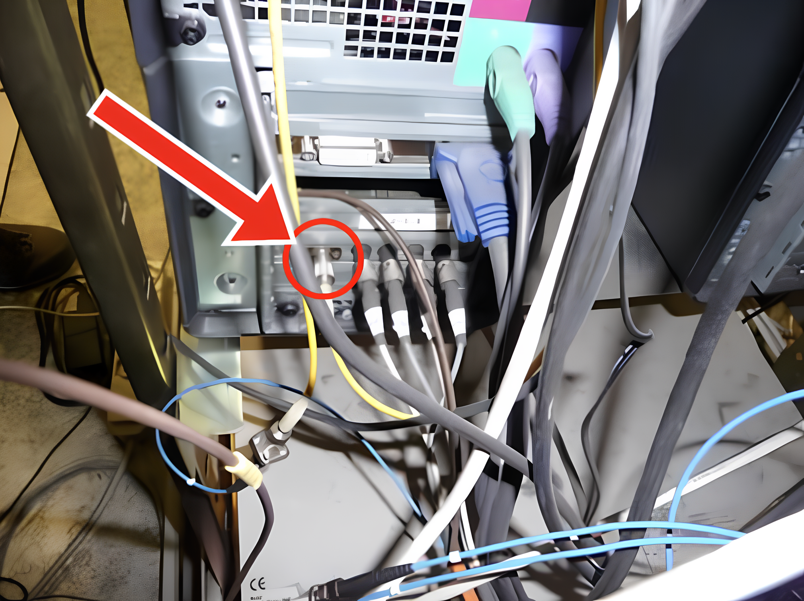

_Loose fiber optic cable that caused the measurement error \[4\]_

</center>

---

<!-- _class: vcenter invert -->

# How to Control Your Benchmarking Environment

---

<!-- _class: vcenter -->
<!-- footer: "How to Control Your Benchmarking Environment" -->

<div class="centered-table">

| Layer       | Sources of Noise                                                                | Mitigations                                                                |
| ----------- | ------------------------------------------------------------------------------- | -------------------------------------------------------------------------- |
| External    | Network<br>Temperature<br>Vibration<br>Noisy neighbors                          | Use dedicated on-prem hardware<br>Use dedicated/bare metal cloud instances |
| Application | Memory layout<br>Compilation/linking                                            | Set up fixed builds (e.g., disable ASLR)                                   |
| Kernel      | Scheduling<br>Filesystem cache                                                  | Set CPU affinity<br>Set process priority<br>Warm up or drop caches         |
| CPU         | Simultaneous multithreading (SMT) contention<br>Dynamic frequency scaling (DFS) | Disable SMT<br>Disable DFS                                                 |

</div>

---

<!-- _class: vcenter -->

<div class="centered-table">

| Layer                            | Sources of Noise                                                                                        | Mitigations                                                                                        |
| -------------------------------- | ------------------------------------------------------------------------------------------------------- | -------------------------------------------------------------------------------------------------- |
| <span class="hl">External</span> | Network<br>Temperature<br>Vibration<br><span class="hl">Noisy neighbors</span>                          | Use dedicated on-prem hardware<br><span class="hl">Use dedicated/bare metal cloud instances</span> |
| Application                      | Memory layout<br>Compilation/linking                                                                    | Set up fixed builds (e.g., disable ASLR)                                                           |
| <span class="hl">Kernel</span>   | <span class="hl">Scheduling<br>Filesystem cache</span>                                                  | <span class="hl">Set CPU affinity<br>Set process priority<br>Warm up or drop caches</span>         |
| <span class="hl">CPU</span>      | <span class="hl">Simultaneous multithreading (SMT) contention<br>Dynamic frequency scaling (DFS)</span> | <span class="hl">Disable SMT<br>Disable DFS</span>                                                 |

</div>

<div class="bottom-citation">

_Bakhvalov, "Performance Analysis and Tuning on Modern CPUs", Appendix A \[5\]_

</div>

---

<!-- _class: vcenter -->

<div class="centered-table">

| Layer  | Sources of Noise               | Mitigations                                                        |
| ------ | ------------------------------ | ------------------------------------------------------------------ |
| Kernel | Scheduling<br>Filesystem cache | Set CPU affinity<br>Set process priority<br>Warm up or drop caches |

</div>

```bash
# Set CPU affinity
taskset -c 0 ./benchmark

# Set process priority
nice -n -5 ./benchmark

# Drop filesystem cache
echo 3 > /proc/sys/vm/drop_caches && sync
```

---

<!-- _class: vcenter -->

<div class="centered-table">

| Layer | Sources of Noise                             | Mitigations |
| ----- | -------------------------------------------- | ----------- |
| CPU   | Simultaneous multithreading (SMT) contention | Disable SMT |

</div>

---

## What's SMT?

<div class="columns">

<div>
<center>

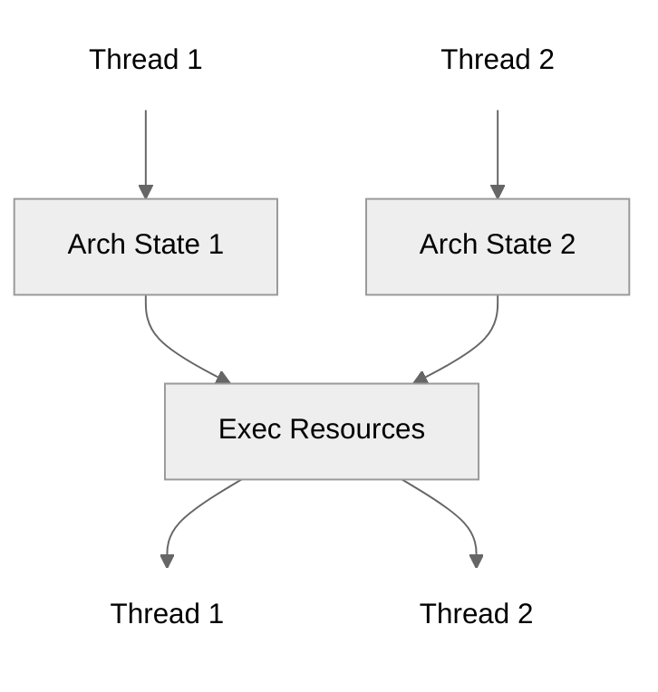
```mermaid
%%{init: {'theme': 'neutral'}}%%

graph TB
    T1[Thread 1] --> AS1["Arch State 1"]
    T2[Thread 2] --> AS2["Arch State 2"]
    AS1 --> E["Exec Resources"]
    AS2 --> E
    E --> O1[Thread 1]
    E --> O2[Thread 2]
    style T1 fill:none,stroke:none
    style T2 fill:none,stroke:none
    style O1 fill:none,stroke:none
    style O2 fill:none,stroke:none
```

_SMT enabled_

</center>
</div>

<div>
<center>

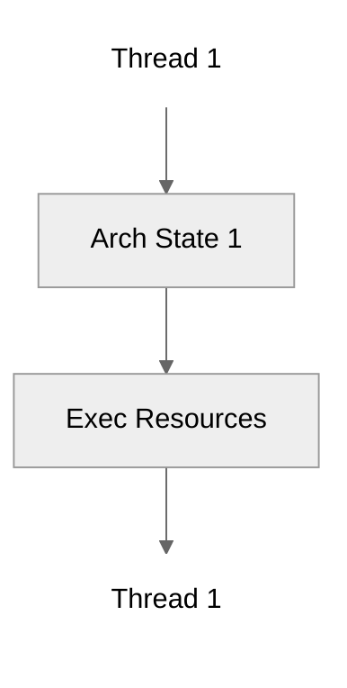
```mermaid
%%{init: {'theme': 'neutral'}}%%

graph TB
    T1[Thread 1] --> AS1["Arch State 1"]
    AS1 --> E1["Exec Resources"]
    E1 --> O1[Thread 1]
    style T1 fill:none,stroke:none
    style O1 fill:none,stroke:none
```

_SMT disabled_

</center>
</div>

</div>

---

<!-- _class: vcenter -->

```bash
# Disable SMT
echo off > /sys/devices/system/cpu/smt/control
```

---

## What's the impact of disabling SMT?

<center>

m5.metal, dynamic frequency scaling (DFS) disabled
**2 CPU-intensive tasks on same core (smt) vs. separate cores (no-smt)**

</center>

<div class="columns">

<div>

<center>


</center>

</div>

<!-- To align with the graph's borders -->
<div style="padding-top: 43px;">

| Thread   | mean ± stddev       | coeff. of variation |
| -------- | ------------------- | ------------------- |
| smt-1    | 1537.64 ± 367.29 ms | 23.887 %            |
| smt-2    | 1536.88 ± 366.84 ms | 23.869 %            |
| no-smt-1 | 737.37 ± 0.32 ms    | 0.044 %             |
| no-smt-2 | 737.93 ± 1.74 ms    | 0.235 %             |

</div>

</div>

---

## What's the impact of disabling SMT?

<center>

m5.metal, dynamic frequency scaling (DFS) disabled
**2 CPU-intensive tasks on same core (smt) vs. separate cores (no-smt)**

</center>

<div class="columns">

<div>

<center>


</center>

</div>

<!-- To align with the graph's borders -->
<div style="padding-top: 43px;">

| Thread   | mean ± stddev       | coeff. of variation              |
| -------- | ------------------- | -------------------------------- |
| smt-1    | 1537.64 ± 367.29 ms | <span class="hl">23.887 %</span> |
| smt-2    | 1536.88 ± 366.84 ms | <span class="hl">23.869 %</span> |
| no-smt-1 | 737.37 ± 0.32 ms    | <span class="hl">0.044 %</span>  |
| no-smt-2 | 737.93 ± 1.74 ms    | <span class="hl">0.235 %</span>  |

</div>

</div>

<div style="transform: translateY(-30px);">

<center>

**<span class="hl">100x less variation</span>**

</center>

</div>

<div class="bottom-citation">

_Experiments by Dmytro_

</div>

---

<!-- _class: vcenter -->

<div class="centered-table">

| Layer | Sources of Noise                | Mitigations |
| ----- | ------------------------------- | ----------- |
| CPU   | Dynamic frequency scaling (DFS) | Disable DFS |

</div>

---

## What's DFS?

<center>

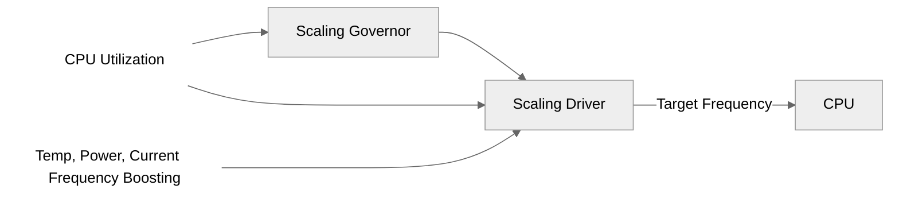
```mermaid
%%{init: {'theme': 'neutral'}}%%

graph LR
    Load["CPU Utilization"] --> Gov["Scaling Governor"]
    Gov --> Driver["Scaling Driver"]
    Load --> Driver
    Physical[ Temp, Power, Current <br>Frequency Boosting] ---> Driver
    Driver -- "Target Frequency" --> CPU

    style Load fill:none,stroke:none
    style Physical fill:none,stroke:none
```

_DFS enabled_


```mermaid
%%{init: {'theme': 'neutral'}}%%

graph LR
    Freq["User-defined Frequency"] --> Gov["Scaling Governor"]
    Gov --> Driver["Scaling Driver"]
    Driver -- "Target Frequency" --> CPU

    style Freq fill:none,stroke:none
```

_DFS disabled_

</center>

---

<!-- _class: vcenter -->

```bash
# Pin clock rate
echo 2500000 > /sys/devices/system/cpu/cpu*/cpufreq/scaling_min_freq
echo 2500000 > /sys/devices/system/cpu/cpu*/cpufreq/scaling_max_freq

# Set scaling governor to "performance"
echo performance > /sys/devices/system/cpu/cpu*/cpufreq/scaling_governor

# Disable frequency boosting (Turbo-Boost, Intel CPUs only)
echo 1 > /sys/devices/system/cpu/intel_pstate/no_turbo
```

---

## What's the impact of disabling DFS?

<center>

m5.metal, simultaneous multithreading (SMT) disabled
**Varying number of CPU-intensive tasks on the same core with DFS on vs. off**

</center>

<div class="columns">

<div>

<center>


</center>

</div>

<div style="padding-top: 35px;">

| Thread   | mean ± stddev     | coeff. of variation |
| -------- | ----------------- | ------------------- |
| dfs-1    | 533.97 ± 2.046 ms | 0.383 %             |
| dfs-8    | 578.67 ± 0.287 ms | 0.050 %             |
| no-dfs-1 | 738.18 ± 0.306 ms | 0.041 %             |
| no-dfs-8 | 739.18 ± 0.351 ms | 0.047 %             |

</div>

</div>

---

## What's the impact of disabling DFS?

<center>

m5.metal, simultaneous multithreading (SMT) disabled
**Varying number of CPU-intensive tasks on the same core with DFS on vs. off**

</center>

<div class="columns">

<div>

<center>


</center>

</div>

<div style="padding-top: 35px;">

| Thread   | mean ± stddev                             | coeff. of variation             |
| -------- | ----------------------------------------- | ------------------------------- |
| dfs-1    | <span class="hl">533.97</span> ± 2.046 ms | <span class="hl">0.383 %</span> |
| dfs-8    | <span class="hl">578.67</span> ± 0.287 ms | 0.050 %                         |
| no-dfs-1 | 738.18 ± 0.306 ms                         | <span class="hl">0.041 %</span> |
| no-dfs-8 | 739.18 ± 0.351 ms                         | 0.047 %                         |

</div>

</div>

<div style="transform: translateY(-30px);">

<center>

**<span class="hl">10x less variation</span>**
**<span class="hl">Removes unpredictable bias</span>**

</center>

</div>

<div class="bottom-citation">

_Experiments by Dmytro_

</div>

---

<!-- _class: vcenter -->

<center>

| Layer    | Sources of Noise | Mitigations                   |
| -------- | ---------------- | ----------------------------- |
| External | Vibration        | Don't shout in the datacenter |

</center>

---

<!-- _class: vcenter -->

<center>

_[🔗 Shouting in the Datacenter](https://www.youtube.com/watch?v=tDacjrSCeq4)_

 

</center>

---

<!-- _class: vcenter invert -->
<!-- footer: "" -->

# How to Design Benchmarks

---

<!-- _class: vcenter -->
<!-- footer: "How to Design Benchmarks" -->

<center>

_"All happy families are alike; each unhappy family is unhappy in its own way."_

— Leo Tolstoy, _Anna Karenina_

</center>

---

<!-- _class: vcenter -->

<center>

_"All happy <span class="replace"><span class="old">families</span><span class="new">benchmarks</span></span> are alike; each unhappy <span class="replace"><span class="old">family</span><span class="new">benchmark</span></span> is unhappy in its own way."_

</center>

---

<!-- _class: vcenter -->

<center>

<span class="medium">**`representative`** and **`repeatable`**</span>

</center>

---

## Representative workloads

What does your application actually do?

- **CPU-bound**: Number crunching, compression, encryption
- **I/O-bound**: Database queries, API calls, file operations
- **Mixed**: Most real-world applications

<br>

_Your benchmark workload should match your production workload._

---

## Workload archetypes

<div class="centered-table">

| Archetype       | Pattern                          | Characteristics                        |
| --------------- | -------------------------------- | -------------------------------------- |
| **Idle**        | Background workers, minimal load | Low RPS, minimal CPU, few workers      |
| **Latency**     | Microservices, APIs              | High RPS, low CPU per request          |
| **Throughput**  | Queue workers, batch processing  | Moderate RPS, high CPU, many clients   |
| **Enterprise**  | Business apps with DB/API calls  | Moderate RPS, mixed CPU/I/O            |

</div>

<br>

_Choose the archetype that matches your application's behavior._

---

## An unhappy benchmark

- Goal: Measuring dd-trace-java instrumentation overhead on a Spring app.

---

## An unhappy benchmark

- Goal: Measuring dd-trace-java instrumentation overhead on a Spring app.
- **System under test: Spring app instrumented (or not) with dd-trace-java.**

---

## An unhappy benchmark

- Goal: Measuring dd-trace-java instrumentation overhead on a Spring app.
- System under test: Spring app instrumented (or not) with dd-trace-java.
- **Workload: As many requests as possible by 5 concurrent users.**

---

## An unhappy benchmark

- Goal: Measuring dd-trace-java instrumentation overhead on a Spring app.
- System under test: Spring app instrumented (or not) with dd-trace-java.
- Workload: As many requests as possible by 5 concurrent users.
- **20 second warmup, 15 seconds of actual measurements.**

---

<center>

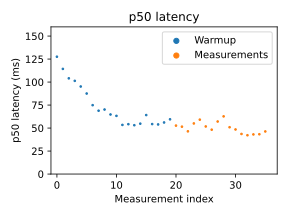

Many **false positives** and **high coeff. of variation** (= standard deviation / mean) of 11.80%.

</center>

---

<center>


Many **false positives** and **high coeff. of variation** (= standard deviation / mean) of 11.80%.

**Are we running the benchmark long enough?**

</center>

---

<center>

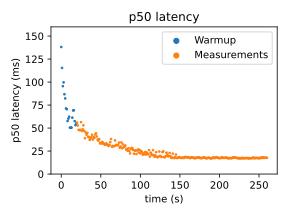

</center>

---

<center>


**Tip #1: Run benchmarks for longer to uncover perturbations (e.g., warmup effects).**

</center>

---

<center>


Tip #1: Run benchmarks for longer to uncover perturbations (e.g., warmup effects).

**For how long should we run the benchmark?**

</center>

---

<div class="columns">

<div>

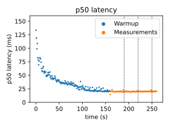

</div>

<div style="padding-top: 100px;">
<div class="centered-table">

| # measurements | coeff. of variation |
| -------------- | ------------------- |
| 30             | 6.95%               |
| 60             | 5.23%               |
| 90             | 4.59%               |

</div>
</div>

</div>

---

<div class="columns">

<div>


</div>

<div style="padding-top: 100px;">
<div class="centered-table">

| # measurements | coeff. of variation |
| -------------- | ------------------- |
| 30             | 6.95%               |
| 60             | 5.23%               |
| 90             | 4.59%               |

</div>
</div>

</div>

<center>

**Tip #2: Collect enough samples to reduce intra-run variation (N ≥ 30).**

</center>

---

<div class="columns">

<div>


</div>

<div style="padding-top: 100px;">
<div class="centered-table">

| # measurements | coeff. of variation |
| -------------- | ------------------- |
| 30             | 6.95%               |
| 60             | 5.23%               |
| 90             | 4.59%               |

</div>
</div>

</div>

<center>

Tip #2: Collect enough samples to reduce intra-run variation (N ≥ 30).

**But what about inter-run variation?**

</center>

---

<!-- _class: vcenter -->

<center>

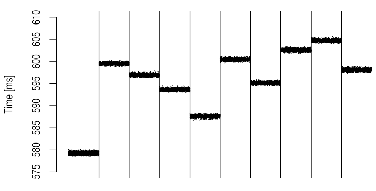

_Impact of initial state on FFT benchmark results \[6\]_

</center>

---

<!-- _class: vcenter -->

<center>

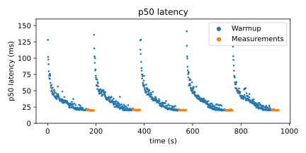

</center>

---

<!-- _class: vcenter -->

<center>

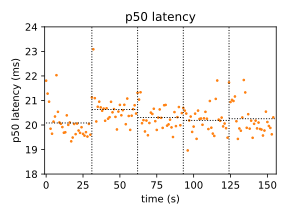

</center>

---

<div class="columns">

<div>

<center>


</center>

</div>

<div style="padding-top: 45px;">

<div class="centered-table">

| Run # | mean ± stddev   | coeff. of variation |
| ----- | --------------- | ------------------- |
| 1     | 20.08 ± 0.63 ms | 3.16%               |
| 2     | 20.63 ± 0.56 ms | 2.72%               |
| 3     | 20.31 ± 0.45 ms | 2.23%               |
| 4     | 20.19 ± 0.54 ms | 2.66%               |
| 5     | 20.26 ± 0.63 ms | 3.11%               |
| all   | 20.29 ± 0.60 ms | 2.94%               |

</div>

</div>

</div>

---

<div class="columns">

<div>

<center>


</center>

</div>

<div style="padding-top: 45px;">

<div class="centered-table">

| Run # | mean ± stddev   | coeff. of variation |
| ----- | --------------- | ------------------- |
| 1     | 20.08 ± 0.63 ms | 3.16%               |
| 2     | 20.63 ± 0.56 ms | 2.72%               |
| 3     | 20.31 ± 0.45 ms | 2.23%               |
| 4     | 20.19 ± 0.54 ms | 2.66%               |
| 5     | 20.26 ± 0.63 ms | 3.11%               |
| all   | 20.29 ± 0.60 ms | 2.94%               |

</div>

</div>

</div>

<center>

**Tip #3: Rerun benchmarks multiple times to reduce inter-run variation (M ≥ 5).**

</center>

---

Tip #1: Run benchmarks for longer to uncover perturbations (e.g., warmup effects).

Tip #2: Collect enough samples to reduce intra-run variation (N ≥ 30).

Tip #3: Rerun benchmarks multiple times to reduce inter-run variation (M ≥ 5).

<br>

<center>

Coefficient of variation: 11.80% → **2.94%**

</center>

---

Tip #1: Run benchmarks for longer to uncover perturbations (e.g., warmup effects).

Tip #2: Collect enough samples to reduce intra-run variation (N ≥ 30).

Tip #3: Rerun benchmarks multiple times to reduce inter-run variation (M ≥ 5).

<br>

<center>

Coefficient of variation: 11.80% → **2.94%**

</center>

<br>

**Tip #4: Use deterministic inputs.**

---

Tip #1: Run benchmarks for longer to uncover perturbations (e.g., warmup effects).

Tip #2: Collect enough samples to reduce intra-run variation (N ≥ 30).

Tip #3: Rerun benchmarks multiple times to reduce inter-run variation (M ≥ 5).

<br>

<center>

Coefficient of variation: 11.80% → **2.94%**

</center>

<br>

Tip #4: Use deterministic inputs.

**Tip #5: Use load generators that avoid the coordinated omission problem (e.g., k6).**

---

Tip #1: Run benchmarks for longer to uncover perturbations (e.g., warmup effects).

Tip #2: Collect enough samples to reduce intra-run variation (N ≥ 30).

Tip #3: Rerun benchmarks multiple times to reduce inter-run variation (M ≥ 5).

<br>

<center>

Coefficient of variation: 11.80% → **2.94%**

</center>

<br>

Tip #4: Use deterministic inputs.

Tip #5: Use load generators that avoid the coordinated omission problem (e.g., k6).

<center>

**But what about inter-experiment variation?**

</center>

---

Tip #1: Run benchmarks for longer to uncover perturbations (e.g., warmup effects).

Tip #2: Collect enough samples to reduce intra-run variation (N ≥ 30).

Tip #3: Rerun benchmarks multiple times to reduce inter-run variation (M ≥ 5).

<br>

<center>

Coefficient of variation: 11.80% → **2.94%**

</center>

<br>

Tip #4: Use deterministic inputs.

Tip #5: Use load generators that avoid the coordinated omission problem (e.g., k6).

<center>

But what about inter-experiment variation?

</center>

**Tip #0: Control your benchmarking environment.**

---

<!-- _class: vcenter invert -->
<!-- footer: "" -->

# Interpreting Benchmark Results

---

<!-- footer: "Interpreting Benchmark Results" -->
<!-- _class: vcenter -->

<center>

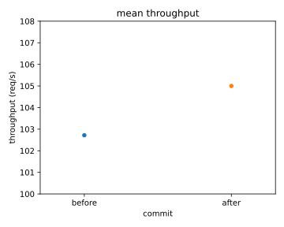

</center>

---

<!-- _class: vcenter -->

<center>

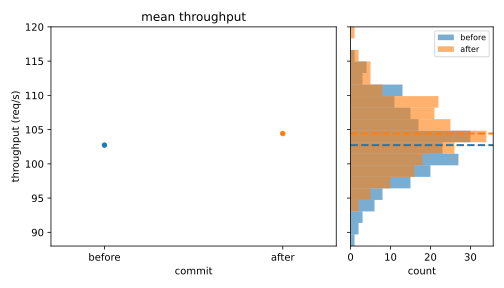

<br>

</center>

---

<!-- _class: vcenter -->

<center>


**How can we tell if the difference is big enough?**

</center>

---

<!-- _class: vcenter -->

<center>

$$\frac{\text{how big the difference is}}{\text{how big the noise is}}$$

</center>

---

<!-- _class: vcenter -->

<center>

$$t = \frac{\text{how big the difference is}}{\text{how big the noise is}}$$

</center>

---

<!-- _class: vcenter -->

<center>

$$t = \frac{\text{how big the difference is}}{\text{how big the noise is}}$$

$$t > \text{critical value}$$

</center>

---

<!-- _class: vcenter -->

<center>

$$t = \frac{\text{how big the difference is}}{\text{how big the noise is}} = \frac{\bar{x}_1 - \bar{x}_2}{\sqrt{\frac{s_1^2}{n_1} + \frac{s_2^2}{n_2}}}$$

$$t > \text{critical value}$$

</center>

---

<!-- _class: vcenter -->

<center>

$$t = \frac{\text{how big the difference is}}{\text{how big the noise is}} = \frac{\bar{x}_1 - \bar{x}_2}{\sqrt{\frac{s_1^2}{n_1} + \frac{s_2^2}{n_2}}}$$

$$t > \text{critical value}$$

**Hypothesis test.**

</center>

---

## Hypothesis test

**If t > critical value, reject the null hypothesis.**

---

## Hypothesis test

If t > critical value, reject the null hypothesis.

**Null hypothesis: no difference.**

---

## Hypothesis test

If t > critical value, reject the null hypothesis.

Null hypothesis: no difference.

**Alternative hypothesis: enough difference.**

---

## Hypothesis test

If t > critical value, reject the null hypothesis.

Null hypothesis: no difference.

Alternative hypothesis: enough difference.

**t, or t-statistic: difference/noise.**

---

## Hypothesis test

If t > critical value, reject the null hypothesis.

Null hypothesis: no difference.

Alternative hypothesis: enough difference.

t, or t-statistic: difference/noise.

**Critical value: threshold based on your tolerance for false positives.**

---

## Hypothesis test

If t > critical value, reject the null hypothesis.

Null hypothesis: no difference.

Alternative hypothesis: enough difference.

t, or t-statistic: difference/noise.

Critical value: threshold based on your tolerance for false positives.

**In practice, we use the p-value: p < α**

**p-value: probability of seeing this result if there's no real difference.**

**α: false positive rate you're willing to tolerate.**

---

<!-- _class: vcenter -->

```python
from scipy import stats

alpha = 0.05
t_stat, p_value = stats.ttest_ind(before, after)

if p_value < alpha:
    print("Statistically significant difference")
```

---

## Choosing α

**α = 0.05** (5%) is a common threshold for false positives.

Confidence level = 1 - α = 95%

---

## Choosing α

α = 0.05 (5%) is a common threshold for false positives.

Confidence level = 1 - α = 95%

**Trade-off**

- **Lower α (1%):** Fewer false positives, fewer detections.
- **Higher α (10%):** More false positives, more detections.

---

## Another approach: changepoint detection

<!-- footer: "" -->

<center>

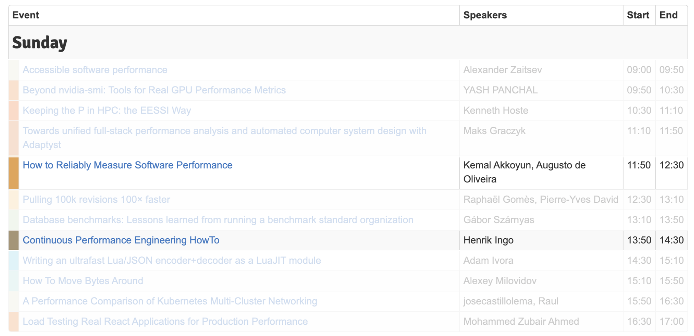

_Want to learn more about detecting performance regressions?_
_Stay for the next talk._

</center>

---

<!-- _class: vcenter invert -->

# Integrating Benchmarks Into Your Workflows

---

<!-- footer: "Integrating Benchmarks Into Your Workflows" -->

## Architecture Overview

<!-- TODO: Add architecture diagram showing benchmark pipeline -->

<center>

_Placeholder for Datadog benchmark pipeline diagram_

</center>

---

## Feedback Loop

<center>

<!-- TODO: Add screenshot of PR comment showing regression -->

_Placeholder for PR comment screenshot_

_Catch regressions before they merge_

</center>

<div class="bottom-citation">

_Benchmarks should be locally reproducible for developers to take action._

</div>

---

## Performance Quality Gates

<center>

<!-- TODO: Add screenshot of quality gate with SLO breach -->

_Placeholder for quality gate screenshot_

_Block releases that don't meet SLOs_

</center>

---

## Alerts & Dashboards

<center>

<!-- TODO: Add screenshot of Slack alerts and dashboards -->

_Placeholder for alerts and dashboards screenshot_

</center>

---

## Operational Excellence Reviews

<center>

<!-- TODO: Add screenshot of operational excellence review -->

_Placeholder for operational excellence review screenshot_

_Track performance trends over time_

</center>

---

## Open Source Tools

**Start running benchmarks continuously today:**

- [bencher.dev](https://bencher.dev/) - Continuous benchmarking platform
- [hyperfine](https://github.com/sharkdp/hyperfine) - CLI benchmark tool
- [github-action-benchmark](https://github.com/benchmark-action/github-action-benchmark) - GitHub Action
- [chronologer](https://github.com/dandavison/chronologer) - Benchmark tracking

<br>

_We're working on open-sourcing our tooling._

---

<!-- _class: vcenter invert -->
<!-- footer: "" -->

# Conclusion

---

<!-- footer: "Conclusion" -->

## Key Takeaways

1. **Control your benchmarking environment**
   Bare metal, disable SMT, disable DFS

2. **Design your benchmarks**
   Representative and repeatable

3. **Interpret benchmark results**
   Statistics matter (hypothesis testing)

4. **Integrate benchmarks into your workflows**
   Run continuously, catch regressions early

---

<!-- _class: vcenter hcenter -->

<span class="big">**Performance matters.**</span>

Low latency. High throughput. Better user experience.

Write benchmarks. Run them continuously.

---

<!-- _class: vcenter invert -->
<!-- footer: "" -->

<style scoped>
.columns {
    height: 100%;
    align-items: center;
}
.columns > div:first-child {
    display: flex;
    justify-content: center;
    align-items: center;
}
</style>

<div class="columns">

<div>

# Thanks

</div>
<div>


</div>

</div>

---

<style scoped>
p { font-size: 0.5em; line-height: 1.4; }
</style>

# References

\[1\] Universität Münster. "Neutrino oscillations in the neutrino beam from CERN to Gran Sasso." <https://www.uni-muenster.de/Physik.KP/en/AGFrekers/forschung/opera.html>. Accessed Jan 2026.
\[2\] CERN. (1999). "From Geneva to Gran Sasso in 2.5 milliseconds!". <https://home.cern/news/press-release/cern/geneva-gran-sasso-25-milliseconds>. Accessed Jan 2026.
\[3\] Wikipedia. "OPERA experiment." <https://en.wikipedia.org/wiki/OPERA_experiment>. Accessed Jan 2026.
\[4\] Strassler, M. (2012). "OPERA: What Went Wrong." <https://profmattstrassler.com/articles-and-posts/particle-physics-basics/neutrinos/neutrinos-faster-than-light/opera-what-went-wrong/>. Accessed Jan 2026.
\[5\] Bakhvalov, D. (2020). _Performance Analysis and Tuning on Modern CPUs_.
\[6\] Kalibera, T., Bulej, L., and Tuma, P. (2005). "Benchmark Precision and Random Initial State." In _Proceedings of the International Symposium on Performance Evaluation of Computer and Telecommunication Systems (SPECTS)_, pages 182-196. SCS.
\[7\] Valles, A. (2009). "Performance Insights to Intel Hyper-Threading Technology." <https://web.archive.org/web/20150217050949/https://software.intel.com/en-us/articles/performance-insights-to-intel-hyper-threading-technology/>. Accessed Jan 2026.
\[8\] Gregg, B. (2014). "Frequency Trails: Outliers." <https://www.brendangregg.com/FrequencyTrails/outliers.html#Causes>. Accessed Jan 2026.
\[9\] Gregg, B. (2020). "Systems Performance: Enterprise and the Cloud.", p. 233, "P-states and C-states."
\[10\] Humenay, E., Tarjan, D., and Skadron, K. (2007). "Impact of Process Variations on Multicore Performance Symmetry."
\[11\] Linux Kernel Documentation. "CPUFreq Governors." <https://www.kernel.org/doc/Documentation/cpu-freq/governors.txt>. Accessed Jan 2026.
\[12\] ArchWiki. "CPU frequency scaling." <https://wiki.archlinux.org/title/CPU_frequency_scaling>. Accessed Jan 2026.
\[13\] Intel. "Intel Server Board and System Products Update on Intel Turbo Boost Technology Support with Low Power Intel Xeon Processor 3400/5500/5600 Series." <https://cdrdv2-public.intel.com/840590/white_paper_turbo_boost_on_low_power_processor.pdf>. Accessed Jan 2026.
