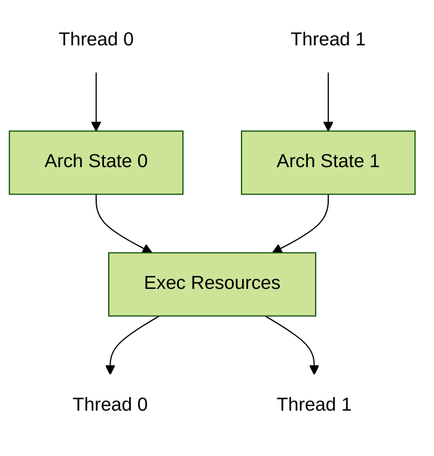
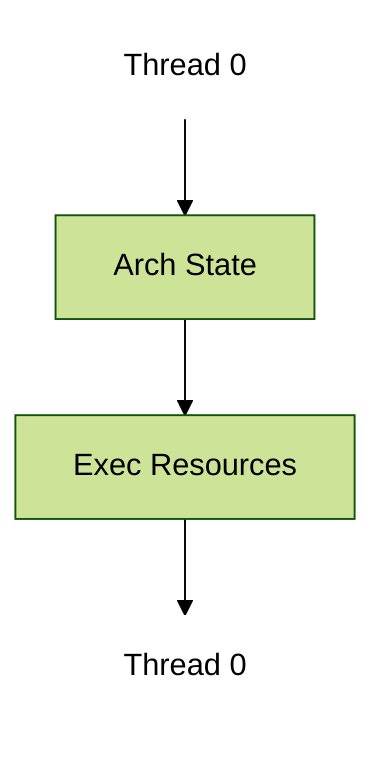
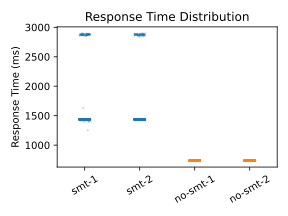

# How to Reliably Measure Software Performance

Augusto de Oliveira, Kemal Akkoyun

FOSDEM 2026

---

<center>


*[Lingchi](https://en.wikipedia.org/wiki/Lingchi), or "death by a thousand cuts"*

</center>

---

## Agenda

How to:
1. Control your benchmarking environment
2. Design your benchmarks
3. Interpret benchmark results
4. Integrate benchmarks into your workflows

---

# How to control your benchmarking environment

---

<center>


*732 km neutrino beam path from CERN in Geneva to Gran Sasso \[1\]*

</center>

---

<center>


</center>

---

<center>

<span class="big">100 M€</span>[cern1999]

</center>

---

<center>


*Loose fiber optic cable that caused the measurement error \[2\]*

</center>

---

<div class="section-header">How to control your benchmarking environment</div>

<div class="centered-table">

| Layer       | Noise Sources                      | Mitigations|
|-------------|------------------------------------|------------|
| External    | Network<br>Temperature<br>Vibration    | Use dedicated hardware |
| Application | Memory layout<br>Compilation/linking | Set up fixed builds (e.g., disable ASLR)|
| Kernel      | Filesystem cache<br>Scheduling | Set CPU affinity<br>Set process priority<br>Warm up or drop caches|
| CPU         | Dynamic frequency scaling<br>Simultaneous multithreading (SMT) contention  | Pin clock rate to base frequency<br>Set scaling governor to "performance"<br>Disable SMT<br>Disable Turbo-boost |

</div>

---

<div class="section-header">How to control your benchmarking environment</div>

<div class="centered-table">

| Layer       | Noise Sources                      | Mitigations|
|-------------|------------------------------------|------------|
| External    | Network<br>Temperature<br>Vibration    | Use dedicated hardware |
| Application | Memory layout<br>Compilation/linking | Set up fixed builds (e.g., disable ASLR)|
| Kernel      | Filesystem cache<br>Scheduling | <span class="hl">Set CPU affinity<br>Set process priority<br>Warm up or drop caches</span>|
| CPU         | Dynamic frequency scaling<br>Simultaneous multithreading (SMT) contention  | <span class="hl">Pin clock rate to base frequency<br>Set scaling governor to "performance"<br>Disable SMT<br>Disable Turbo-boost</span> |

</div>

<div class="bottom-citation">

*Bakhvalov, "Performance Analysis and Tuning on Modern CPUs", Appendix A*

</div>

---

<div class="section-header">How to control your benchmarking environment</div>

<br>

```bash
# CPU affinity
taskset -c 0 ./benchmark

# Process priority
nice -n -5 ./benchmark

# Filesystem cache
echo 3 > /proc/sys/vm/drop_caches && sync

# Pin clock rate
echo 2500000 > /sys/devices/system/cpu/cpu*/cpufreq/scaling_min_freq
echo 2500000 > /sys/devices/system/cpu/cpu*/cpufreq/scaling_max_freq

# Scaling governor
echo performance > /sys/devices/system/cpu/cpu*/cpufreq/scaling_governor

# Disable SMT
echo off > /sys/devices/system/cpu/smt/control

# Disable Turbo Boost
echo 1 > /sys/devices/system/cpu/intel_pstate/no_turbo
```

---

<div class="section-header">How to control your benchmarking environment</div>

## What's the impact of disabling SMT?

<div class="columns">

<div>
<center>


```mermaid
%%{init: {'theme': 'forest'}}%%

graph TB
    T0[Thread 0] --> AS0["Arch State 0"]
    T1[Thread 1] --> AS1["Arch State 1"]
    AS0 --> E["Exec Resources"]
    AS1 --> E
    E --> O0[Thread 0]
    E --> O1[Thread 1]
    style T0 fill:none,stroke:none
    style T1 fill:none,stroke:none
    style O0 fill:none,stroke:none
    style O1 fill:none,stroke:none
```

*SMT enabled: hardware threads compete for resources*

</center>
</div>

<div>
<center>


```mermaid
%%{init: {'theme': 'forest'}}%%

graph TB
    T0[Thread 0] --> AS0["Arch State"]
    AS0 --> E0["Exec Resources"]
    E0 --> O0[Thread 0]
    style T0 fill:none,stroke:none
    style O0 fill:none,stroke:none
```

*SMT disabled: hardware thread has exclusive access to resources*

</center>
</div>

</div>

---

<div class="section-header">How to control your benchmarking environment</div>

## What's the impact of disabling SMT?

<center>

m5.metal, clock rate pinned, scaling governor set to "performance"
**2 CPU-intensive tasks on same core (smt) vs. separate cores (no-smt)**

</center>

<div class="columns">

<div>

<center>



</center>

</div>

<!-- To align with the graph's borders -->
<div style="padding-top: 43px;">

| Thread | mean ± stddev | coeff. of variation |
|--------|---------------|----------------------|
| smt-1 | 1537.64 ± 367.29 ms | 23.887 % |
| smt-2 | 1536.88 ± 366.84 ms | 23.869 % |
| no-smt-1 | 737.37 ± 0.32 ms | 0.044 % |
| no-smt-2 | 737.93 ± 1.74 ms | 0.235 % |

</div>

</div>

---

<div class="section-header">How to control your benchmarking environment</div>

## What's the impact of disabling SMT?

<center>

m5.metal, clock rate pinned, scaling governor set to "performance"
**2 CPU-intensive tasks on same core (smt) vs. separate cores (no-smt)**

</center>

<div class="columns">

<div>

<center>


</center>

</div>

<!-- To align with the graph's borders -->
<div style="padding-top: 43px;">

| Thread | mean ± stddev | coeff. of variation |
|--------|---------------|----------------------|
| smt-1 | 1537.64 ± 367.29 ms | <span class="hl">23.887 %</span> |
| smt-2 | 1536.88 ± 366.84 ms | <span class="hl">23.869 %</span> |
| no-smt-1 | 737.37 ± 0.32 ms | <span class="hl">0.044 %</span> |
| no-smt-2 | 737.93 ± 1.74 ms | <span class="hl">0.235 %</span> |

</div>

</div>

<div style="transform: translateY(-30px);">

<center>

**<span class="hl">100x less variation</span>**

</center>

</div>

---

<div class="section-header">How to control your benchmarking environment</div>

## What's the impact of disabling Turbo Boost?

<center>

m5.metal, SMT disabled
**Varying number of CPU-intensive tasks on the same core with Turbo Boost on vs. off**

</center>

<div class="columns">

<div>

<center>


</center>

</div>

<div style="padding-top: 35px;">

| Thread | mean ± stddev | coeff. of variation |
|--------|---------------|----------------------|
| tb-1 | 533.97 ± 2.046 ms | 0.383 % |
| tb-8 | 578.67 ± 0.287 ms | 0.050 % |
| no-tb-1 | 738.18 ± 0.306 ms | 0.041 % |
| no-tb-8 | 739.18 ± 0.351 ms | 0.047 % |

</div>

</div>

---

<div class="section-header">How to control your benchmarking environment</div>

## What's the impact of disabling Turbo Boost?

<center>

m5.metal, SMT disabled
**Varying number of CPU-intensive tasks on the same core with Turbo Boost on vs. off**

</center>

<div class="columns">

<div>

<center>


</center>

</div>

<div style="padding-top: 35px;">

| Thread | mean ± stddev | coeff. of variation |
|--------|---------------|----------------------|
| tb-1 | <span class="hl">533.97</span> ± 2.046 ms | <span class="hl">0.383 %</span> |
| tb-8 | <span class="hl">578.67</span> ± 0.287 ms | 0.050 % |
| no-tb-1 | 738.18 ± 0.306 ms | <span class="hl">0.041 %</span> |
| no-tb-8 | 739.18 ± 0.351 ms | 0.047 % |

</div>

</div>

<div style="transform: translateY(-30px);">

<center>

**<span class="hl">10x less variation</span>**
**<span class="hl">performance stops depending on workload</span>**

</center>

</div>

---

# Benchmark Design

---

<div class="section-header">Benchmark Design</div>

<center>

*"All happy families are alike; each unhappy family is unhappy in its own way."*

— Leo Tolstoy, *Anna Karenina*

</center>

---

<div class="section-header">Benchmark Design</div>

<center>

*"All happy <span class="replace"><span class="old">families</span><span class="new">benchmarks</span></span> are alike; each unhappy <span class="replace"><span class="old">family</span><span class="new">benchmark</span></span> is unhappy in its own way."*

</center>

---

<div class="section-header">Benchmark Design</div>

<center>

<span class="medium">**representative** and **repeatable**</span>

</center>

---

<div class="section-header">Benchmark Design</div>

## Why is this a bad benchmark?

<center>


*Initial benchmark — high coefficient of variation*

</center>

<span class="comment">

**TODO:** Add initial dd-trace-java benchmark graph with high CoV.

</span>

---

<div class="section-header">Benchmark Design</div>

## Problem #1: Not running long enough

I ran it for longer and got this:

<center>


</center>

<span class="comment">

**TODO:** Add longer run graph showing more data.

</span>

---

<div class="section-header">Benchmark Design</div>

Benchmarks must run long enough.

You need data to uncover problems.

---

<div class="section-header">Benchmark Design</div>

## Problem #2: Warmup and cooldown effects

We were only considering this small sliver of data.

I was benchmarking dd-trace-java instrumenting a simple web server. I needed steady state to compare baseline vs instrumented and compute the overhead.

So I set up a warmup stage on my load tester and dropped the warmup results.

---

<div class="section-header">Benchmark Design</div>

After that, we had something like this.

<center>


</center>

But still not good enough...

---

<div class="section-header">Benchmark Design</div>

...things happen between runs.

<center>


*Impact of initial state on FFT benchmark results — Kalibera et al. \[3\]*

</center>

---

<div class="section-header">Benchmark Design</div>

## Problem #3: Not enough runs

So I ran more runs to see if variability went down.

<center>


</center>

<span class="comment">

**TODO:** Add graph showing more runs with reduced variability.

</span>

---

<div class="section-header">Benchmark Design</div>

## A Good Benchmark

Finally, a benchmark that:

1. Measures the right thing
2. Considers warmup effects
3. Runs long enough
4. Runs enough times

---

<div class="section-header">Benchmark Design</div>

## Two Other Problems

1. **Random effects**: use deterministic seeds, avoid non-deterministic inputs
2. **Coordinated omission**: in open-loop load testing, if you only measure requests that complete, you miss the worst latencies

---

# Interpreting Benchmark Results

---

<div class="section-header">Interpreting Benchmark Results</div>

## The Naive Approach Isn't Enough

<center>


*Two noisy signals with different means but insufficient statistical difference*

</center>

<span class="comment">

- **TODO:** Maybe remove the title for this slide to make the image more impactful.

</span>

---

<div class="section-header">Interpreting Benchmark Results</div>

<div class="columns">

<div>

<center>


*Highly overlapping histograms*

</center>

</div>

<div>

<center>


*Clearly different histograms*

</center>

</div>

</div>

<span class="comment">

**Purpose:** Show the intuition behind hypothesis testing.

</span>

---

<div class="section-header">Interpreting Benchmark Results</div>

## Changepoint Detection

Shout out to Henrik Ingo's talk on changepoint detection.

---

# Integrating Benchmarks Into Your Workflows

---

<div class="section-header">Integrating Benchmarks Into Your Workflows</div>

<center>


*Architecture diagram with highlighted integration points: CI/CD, quality gates, operational excellence reviews, competitor benchmarks*

</center>

<span class="comment">

**Purpose:** Show the overall benchmarking platform architecture and how it integrates with development workflows.

</span>

---

## Real-Life Example

<span class="comment">

**Purpose:** Showcase a real-life example to thread through the integration workflows.

**TODO:** decide on specific example, include real numbers and graphs, show concrete benefits.

We're going to have a slide for each highlighted box in the benchmarking platform architecture diagram, referring to the example and including real numbers and graphs to bring the point home.

</span>

---

# Concluding slides

<span class="comment">

**TODO:** Conclusion (summarizing the takeaways), thank you/questions, contact information, references.

</span>

---

# References

\[1\] "Neutrino oscillations in the neutrino beam from CERN to Gran Sasso." https://www.uni-muenster.de/Physik.KP/en/AGFrekers/forschung/opera.html

\[2\] Strassler, M. (2012). "OPERA: What Went Wrong." https://profmattstrassler.com/articles-and-posts/particle-physics-basics/neutrinos/neutrinos-faster-than-light/opera-what-went-wrong/

\[3\] Kalibera, T., Bulej, L., and Tuma, P. (2005). "Benchmark Precision and Random Initial State."

\[4\] Valles, A. (2009). "Performance Insights to Intel Hyper-Threading Technology." https://web.archive.org/web/20150217050949/https://software.intel.com/en-us/articles/performance-insights-to-intel-hyper-threading-technology/.

---

\[5\] Gregg, B. (2014). "Frequency Trails: Outliers." https://www.brendangregg.com/FrequencyTrails/outliers.html#Causes

\[6\] Gregg, B. (2020). "Systems Performance: Enterprise and the Cloud.", p. 233, "P-states and C-states."

\[7\] Humenay, E., Tarjan, D., and Skadron, K. (2007). "Impact of Process Variations on Multicore Performance Symmetry."

---

\[8\] Bakhvalov, D. (2024). *Performance Analysis and Tuning on Modern CPUs*. https://www.amazon.com/Performance-Analysis-Tuning-Modern-CPUs/dp/B0DMVQ1QDD
k
\[cern1999\] CERN. (1999). "From Geneva to Gran Sasso in 2.5 milliseconds!". https://home.cern/news/press-release/cern/geneva-gran-sasso-25-milliseconds