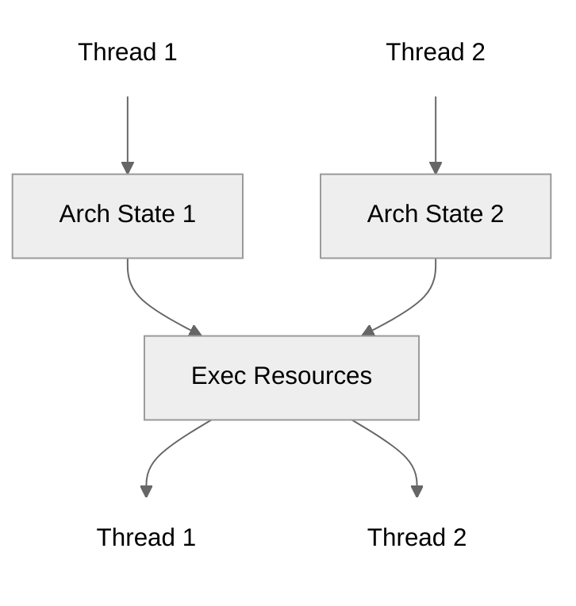
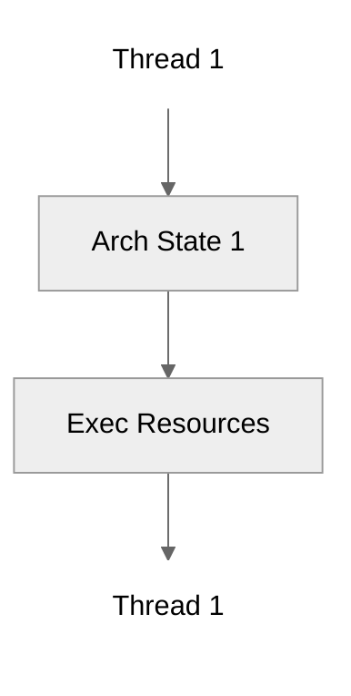
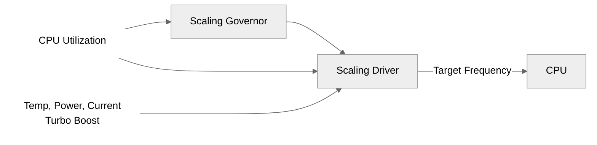

# Google Gemini Deep Research Prompt

## Context

I'm preparing a FOSDEM 2026 presentation titled "How to Reliably Measure Software Performance." The presentation covers environment control, benchmark design, and result interpretation.

## Current Gap

The presentation currently focuses heavily on **CPU-bound workload optimizations**:

- **SMT (Simultaneous Multithreading)**: Disabling to reduce contention
- **DFS (Dynamic Frequency Scaling)**: Pinning CPU frequency to reduce variation

For **I/O-bound workloads**, we only mention:

- **Filesystem cache**: Dropping caches (`echo 3 > /proc/sys/vm/drop_caches`)

## Research Request

Please research **system-level tweaks and mitigations for reducing noise in I/O-bound benchmark workloads** on Linux bare metal systems.

Specifically, I'm looking for:

1. **Disk I/O optimizations**
    - I/O schedulers (noop, deadline, cfq, mq-deadline, bfq, kyber)
    - Block device tuning (read-ahead, queue depth, nr_requests)
    - Direct I/O vs buffered I/O considerations
    - NVMe-specific optimizations

2. **Network I/O optimizations**
    - Interrupt coalescing and affinity
    - Ring buffer sizes
    - TCP tuning parameters (buffer sizes, congestion control)
    - NUMA considerations for network-bound workloads

3. **Memory and page cache**
    - Dirty page writeback tuning (vm.dirty_ratio, vm.dirty_background_ratio)
    - Transparent Huge Pages (THP) impact on I/O benchmarks
    - NUMA memory policies
    - Swap and swappiness settings

4. **Kernel-level I/O isolation**
    - cgroups v2 I/O controllers
    - ionice and I/O priority
    - Isolating I/O-bound benchmarks from system noise

5. **Filesystem-level considerations**
    - Mount options (noatime, nodiratime, barrier settings)
    - Filesystem choice impact (ext4, xfs, btrfs)
    - Journal settings

## Desired Output Format

For each optimization, please provide:

- **What it does**: Brief explanation
- **How to configure it**: Specific commands or sysctl settings
- **Impact on benchmarks**: Expected effect on repeatability/variation
- **Trade-offs**: Any downsides or considerations
- **Academic/industry references**: If available

## Presentation Document

Below is the current presentation for context. Note the structure of the "How to Control Your Benchmarking Environment" section with its table of Sources of Noise and Mitigations:

---

````markdown
---
marp: true
theme: default
math: mathjax
html: true

# columns usage: https://github.com/orgs/marp-team/discussions/192#discussioncomment-1516155

style: |
    .columns {
        display: grid;
        grid-template-columns: repeat(2, minmax(0, 1fr));
        gap: 1rem;
    }
    .comment {
        color: #888;
    }
    .medium {
        font-size: 4em;
    }
    .big {
        font-size: 5em;
    }
    table {
        font-size: 0.7em;
    }
    .centered-table {
        display: flex;
        justify-content: center;
    }
    thead th {
        background-color: #e0e0e0;
    }
    tbody tr {
        background-color: transparent !important;
    }
    .hl {
        background-color: #ffde59;
        padding: 0.1em 0;
    }
    .replace {
        display: inline-flex;
        flex-direction: column;
        align-items: center;
        line-height: 1.2;
    }
    .replace .old {
        text-decoration: line-through;
        color: #888;
    }
    .replace .new {
        font-weight: bold;
    }
    .bottom-citation {
        position: absolute;
        bottom: 40px;
        left: 80px;
        right: 70px;
        text-align: center;
    }
    .vcenter {
        display: flex;
        justify-content: center;
        align-items: center;
        height: 100%;
    }
    section {
        align-content: start;
        padding-top: 50px;
    }
    section.vcenter {
        align-content: center;
    }
    section.hcenter {
        text-align: center;
    }
    section::after {
        top: 30px;
        bottom: auto;
        left: auto;
        right: 70px;
        font-size: 0.8em;
        color: #666;
    }
    header {
        top: 20px;
        bottom: auto;
        left: 30px;
        right: auto;
        font-size: 0.6em;
        color: #666;
    }
    footer {
        top: auto;
        bottom: 20px;
        left: 30px;
        right: auto;
        font-size: 0.6em;
        color: #666;
    }
    .center {
        text-align: center;
        margin-top: 175px;
    }
    a {
        color: #0066cc;
        text-decoration: underline;
    }
---

<!-- _class: vcenter invert -->

# How to Reliably Measure Software Performance

Augusto de Oliveira, Kemal Akkoyun

FOSDEM 2026

---

<!-- paginate: true -->
<!-- _class: vcenter -->

<center>


</center>

---

<!-- _class: vcenter -->

<center>


_\[1\]_

</center>

---

<!-- _class: vcenter -->

<center>

<div class="big">
5 years

~€100M 💸

</div>

_[2, 3]_

</center>

---

<!-- _class: vcenter -->

<center>


</center>

---

<!-- _class: vcenter -->

<center>


_Loose fiber optic cable that caused the measurement error \[4\]_

</center>

---

<!-- _class: vcenter invert -->

<center>

<div class="medium">

Most of us aren't building 730km tunnels.

</div>

<br>

</center>

---

<!-- _class: vcenter -->

<center>

<div class="medium">

Most of us aren't building 730km tunnels.

</div>

_But we deal with "loose cables" every day when measuring software performance._

</center>

---

<!-- _class: vcenter hcenter invert -->

## Quick poll

---

<!-- _class: vcenter hcenter -->
<!-- header: "Quick Poll" -->

**Who here has written a benchmark?** 🙋

---

<!-- _class: vcenter hcenter -->
<!-- header: "Quick Poll" -->

**Who here has written a benchmark?** 🙋

**Who has been surprised by the results?** 🤔

---

<!-- _class: vcenter invert -->
<!-- header: "" -->

# How to Control Your Benchmarking Environment

---

<!-- _class: vcenter -->
<!-- footer: "How to Control Your Benchmarking Environment" -->

<div class="centered-table">

| Layer       | Sources of Noise                                                                | Mitigations                                                        |
| ----------- | ------------------------------------------------------------------------------- | ------------------------------------------------------------------ |
| External    | Network<br>Temperature<br>Vibration<br>Virtualization                           | Use dedicated on-prem hardware<br>Use bare metal cloud instances   |
| Application | Memory layout<br>Compilation/linking                                            | Set up fixed builds (e.g., disable ASLR)                           |
| Kernel      | Scheduling<br>Filesystem cache                                                  | Set CPU affinity<br>Set process priority<br>Warm up or drop caches |
| CPU         | Simultaneous multithreading (SMT) contention<br>Dynamic frequency scaling (DFS) | Disable SMT<br>Disable DFS                                         |

</div>

---

<!-- _class: vcenter -->

<div class="centered-table">

| Layer                            | Sources of Noise                                                                                        | Mitigations                                                                                |
| -------------------------------- | ------------------------------------------------------------------------------------------------------- | ------------------------------------------------------------------------------------------ |
| <span class="hl">External</span> | Network<br>Temperature<br>Vibration<br><span class="hl">Virtualization</span>                           | Use dedicated on-prem hardware<br><span class="hl">Use bare metal cloud instances</span>   |
| Application                      | Memory layout<br>Compilation/linking                                                                    | Set up fixed builds (e.g., disable ASLR)                                                   |
| <span class="hl">Kernel</span>   | <span class="hl">Scheduling<br>Filesystem cache</span>                                                  | <span class="hl">Set CPU affinity<br>Set process priority<br>Warm up or drop caches</span> |
| <span class="hl">CPU</span>      | <span class="hl">Simultaneous multithreading (SMT) contention<br>Dynamic frequency scaling (DFS)</span> | <span class="hl">Disable SMT<br>Disable DFS</span>                                         |

</div>

---

<!-- _class: vcenter -->

<div class="centered-table">

| Layer    | Sources of Noise | Mitigations                    |
| -------- | ---------------- | ------------------------------ |
| External | Virtualization   | Use bare metal cloud instances |

</div>

---

## Why bare metal?

In virtualized environments, your benchmark competes with:

---

## Why bare metal?

In virtualized environments, your benchmark competes with:

- **Hypervisor overhead**: CPU cycles for virtualization

---

## Why bare metal?

In virtualized environments, your benchmark competes with:

- **Hypervisor overhead**: CPU cycles for virtualization
- **Noisy neighbors**: Other VMs on the same host

---

## Why bare metal?

In virtualized environments, your benchmark competes with:

- **Hypervisor overhead**: CPU cycles for virtualization
- **Noisy neighbors**: Other VMs on the same host
- **Resource contention**: Shared caches, memory bandwidth, I/O

---

## Why bare metal?

In virtualized environments, your benchmark competes with:

- **Hypervisor overhead**: CPU cycles for virtualization
- **Noisy neighbors**: Other VMs on the same host
- **Resource contention**: Shared caches, memory bandwidth, I/O

Bare metal eliminates these variables, giving you **full control** over the hardware.

---

## Why bare metal?

In virtualized environments, your benchmark competes with:

- **Hypervisor overhead**: CPU cycles for virtualization
- **Noisy neighbors**: Other VMs on the same host
- **Resource contention**: Shared caches, memory bandwidth, I/O

Bare metal eliminates these variables, giving you **full control** over the hardware.

<br>

_All kernel and CPU mitigations require bare metal access._

---

<!-- _class: vcenter -->

<div class="centered-table">

| Layer  | Sources of Noise               | Mitigations                                                        |
| ------ | ------------------------------ | ------------------------------------------------------------------ |
| Kernel | Scheduling<br>Filesystem cache | Set CPU affinity<br>Set process priority<br>Warm up or drop caches |

</div>

```bash
# Set CPU affinity
taskset -c 0 ./benchmark

# Set process priority
nice -n -5 ./benchmark

# Drop filesystem cache
echo 3 > /proc/sys/vm/drop_caches && sync
```

---

<!-- _class: vcenter -->

<div class="centered-table">

| Layer | Sources of Noise                                                                | Mitigations                |
| ----- | ------------------------------------------------------------------------------- | -------------------------- |
| CPU   | Simultaneous multithreading (SMT) contention<br>Dynamic frequency scaling (DFS) | Disable SMT<br>Disable DFS |

</div>

---

<!-- _class: vcenter -->

<div class="centered-table">

| Layer | Sources of Noise                                                                                        | Mitigations                                        |
| ----- | ------------------------------------------------------------------------------------------------------- | -------------------------------------------------- |
| CPU   | <span class="hl">Simultaneous multithreading (SMT) contention</span><br>Dynamic frequency scaling (DFS) | <span class="hl">Disable SMT</span><br>Disable DFS |

</div>

---

## What's SMT?

<div class="columns">

<div>
<center>



_SMT enabled_

</center>
</div>

<div>
<center>



_SMT disabled_

</center>
</div>

</div>

---

<!-- _class: vcenter -->

```bash
# Disable SMT
echo off > /sys/devices/system/cpu/smt/control
```

---

## What's the impact of disabling SMT?

<center>

m5.metal, dynamic frequency scaling (DFS) disabled
**2 CPU-intensive tasks on same core (smt) vs. separate cores (no-smt)**

</center>

---

## What's the impact of disabling SMT?

<center>

m5.metal, dynamic frequency scaling (DFS) disabled
**2 CPU-intensive tasks on same core (smt) vs. separate cores (no-smt)**

</center>

<center>


</center>

---

## What's the impact of disabling SMT?

<center>

m5.metal, dynamic frequency scaling (DFS) disabled
**2 CPU-intensive tasks on same core (smt) vs. separate cores (no-smt)**

</center>

<center>


</center>

<div class="bottom-citation">

_Strip plots show individual data points; boxplots can hide bimodal distributions. \[8\]_

</div>

---

## What's the impact of disabling SMT?

<center>

m5.metal, dynamic frequency scaling (DFS) disabled
**2 CPU-intensive tasks on same core (smt) vs. separate cores (no-smt)**

</center>

<div class="columns">

<div>

<center>


</center>

</div>

<!-- To align with the graph's borders -->
<div style="padding-top: 43px;">

| Thread   | mean ± stddev       | coeff. of variation |
| -------- | ------------------- | ------------------- |
| smt-1    | 1537.64 ± 367.29 ms | 23.887 %            |
| smt-2    | 1536.88 ± 366.84 ms | 23.869 %            |
| no-smt-1 | 737.37 ± 0.32 ms    | 0.044 %             |
| no-smt-2 | 737.93 ± 1.74 ms    | 0.235 %             |

</div>

</div>

---

## What's the impact of disabling SMT?

<center>

m5.metal, dynamic frequency scaling (DFS) disabled
**2 CPU-intensive tasks on same core (smt) vs. separate cores (no-smt)**

</center>

<div class="columns">

<div>

<center>


</center>

</div>

<!-- To align with the graph's borders -->
<div style="padding-top: 43px;">

| Thread   | mean ± stddev       | coeff. of variation              |
| -------- | ------------------- | -------------------------------- |
| smt-1    | 1537.64 ± 367.29 ms | <span class="hl">23.887 %</span> |
| smt-2    | 1536.88 ± 366.84 ms | <span class="hl">23.869 %</span> |
| no-smt-1 | 737.37 ± 0.32 ms    | <span class="hl">0.044 %</span>  |
| no-smt-2 | 737.93 ± 1.74 ms    | <span class="hl">0.235 %</span>  |

</div>

</div>

<div style="transform: translateY(-30px);">

<center>

**<span class="hl">100x less variation</span>**

</center>

</div>

---

<!-- _class: vcenter -->

<div class="centered-table">

| Layer | Sources of Noise                                                                                        | Mitigations                                        |
| ----- | ------------------------------------------------------------------------------------------------------- | -------------------------------------------------- |
| CPU   | Simultaneous multithreading (SMT) contention<br><span class="hl">Dynamic frequency scaling (DFS)</span> | Disable SMT<br><span class="hl">Disable DFS</span> |

</div>

---

## What's DFS?

<center>



_DFS enabled_


_DFS disabled_

</center>

---

<!-- _class: vcenter -->

```bash
# Pin clock rate
echo 2500000 > /sys/devices/system/cpu/cpu*/cpufreq/scaling_min_freq
echo 2500000 > /sys/devices/system/cpu/cpu*/cpufreq/scaling_max_freq

# Set scaling governor to "performance"
echo performance > /sys/devices/system/cpu/cpu*/cpufreq/scaling_governor

# Disable frequency boosting (Turbo-Boost, Intel CPUs only)
echo 1 > /sys/devices/system/cpu/intel_pstate/no_turbo
```

---

## What's the impact of disabling DFS?

<center>

m5.metal, simultaneous multithreading (SMT) disabled
**Varying number of CPU-intensive tasks on the same core with DFS on vs. off**

</center>

---

## What's the impact of disabling DFS?

<center>

m5.metal, simultaneous multithreading (SMT) disabled
**Varying number of CPU-intensive tasks on the same core with DFS on vs. off**

</center>

<center>


</center>

---

## What's the impact of disabling DFS?

<center>

m5.metal, simultaneous multithreading (SMT) disabled
**Varying number of CPU-intensive tasks on the same core with DFS on vs. off**

</center>

<div class="columns">

<div>

<center>


</center>

</div>

<div style="padding-top: 35px;">

| Thread   | mean ± stddev     | coeff. of variation |
| -------- | ----------------- | ------------------- |
| dfs-1    | 533.97 ± 2.046 ms | 0.383 %             |
| dfs-8    | 578.67 ± 0.287 ms | 0.050 %             |
| no-dfs-1 | 738.18 ± 0.306 ms | 0.041 %             |
| no-dfs-8 | 739.18 ± 0.351 ms | 0.047 %             |

</div>

</div>

---

## What's the impact of disabling DFS?

<center>

m5.metal, simultaneous multithreading (SMT) disabled
**Varying number of CPU-intensive tasks on the same core with DFS on vs. off**

</center>

<div class="columns">

<div>

<center>


</center>

</div>

<div style="padding-top: 35px;">

| Thread   | mean ± stddev                             | coeff. of variation             |
| -------- | ----------------------------------------- | ------------------------------- |
| dfs-1    | <span class="hl">533.97</span> ± 2.046 ms | <span class="hl">0.383 %</span> |
| dfs-8    | <span class="hl">578.67</span> ± 0.287 ms | 0.050 %                         |
| no-dfs-1 | 738.18 ± 0.306 ms                         | <span class="hl">0.041 %</span> |
| no-dfs-8 | 739.18 ± 0.351 ms                         | 0.047 %                         |

</div>

</div>

<div style="transform: translateY(-30px);">

<center>

**<span class="hl">10x less variation</span>**
**<span class="hl">Removes unpredictable bias</span>**

</center>

</div>

---

<!-- _class: vcenter -->

<center>


_SMT and DFS experiments by [Dmytro Y.](https://www.linkedin.com/in/dmytro-y-/)_

</center>

---

<!-- _class: vcenter -->

<center>

| Layer    | Sources of Noise | Mitigations                   |
| -------- | ---------------- | ----------------------------- |
| External | Vibration        | Don't shout in the datacenter |

</center>

---

<!-- _class: vcenter -->

<center>

_[🔗 Shouting in the Datacenter](https://www.youtube.com/watch?v=tDacjrSCeq4)_


</center>

---

<!-- _class: vcenter invert -->
<!-- footer: "" -->

# How to Design Benchmarks

---

<!-- _class: vcenter -->
<!-- footer: "How to Design Benchmarks" -->

<center>

_"All happy families are alike; each unhappy family is unhappy in its own way."_

— Leo Tolstoy, _Anna Karenina_

</center>

---

<!-- _class: vcenter -->

<center>

_"All happy <span class="replace"><span class="old">families</span><span class="new">benchmarks</span></span> are alike; each unhappy <span class="replace"><span class="old">family</span><span class="new">benchmark</span></span> is unhappy in its own way."_

</center>

---

<!-- _class: vcenter -->

<center>

<span class="medium">**`representative`** and **`repeatable`**</span>

</center>

---

## Representative workloads

What does your application actually do?

---

## Representative workloads

What does your application actually do?

- **CPU-bound**: Number crunching, compression, encryption

<br>

---

## Representative workloads

What does your application actually do?

- **CPU-bound**: Number crunching, compression, encryption
- **I/O-bound**: Database queries, API calls, file operations

<br>

---

## Representative workloads

What does your application actually do?

- **CPU-bound**: Number crunching, compression, encryption
- **I/O-bound**: Database queries, API calls, file operations
- **Mixed**: Most real-world applications

<br>

---

## Representative workloads

What does your application actually do?

- **CPU-bound**: Number crunching, compression, encryption
- **I/O-bound**: Database queries, API calls, file operations
- **Mixed**: Most real-world applications

<br>

_Your benchmark workload should match your production workload._

---

## Workload archetypes

<div class="centered-table">

| Archetype      | Pattern                          | Characteristics                      |
| -------------- | -------------------------------- | ------------------------------------ |
| **Idle**       | Background workers, minimal load | Low RPS, minimal CPU, few workers    |
| **Latency**    | Microservices, APIs              | High RPS, low CPU per request        |
| **Throughput** | Queue workers, batch processing  | Moderate RPS, high CPU, many clients |
| **Enterprise** | Business apps with DB/API calls  | Moderate RPS, mixed CPU/I/O          |

</div>

<br>

_Choose the archetype that matches your application's behavior._
````

---

_[Rest of presentation truncated for brevity - focuses on benchmark design tips, hypothesis testing, and CI integration]_
