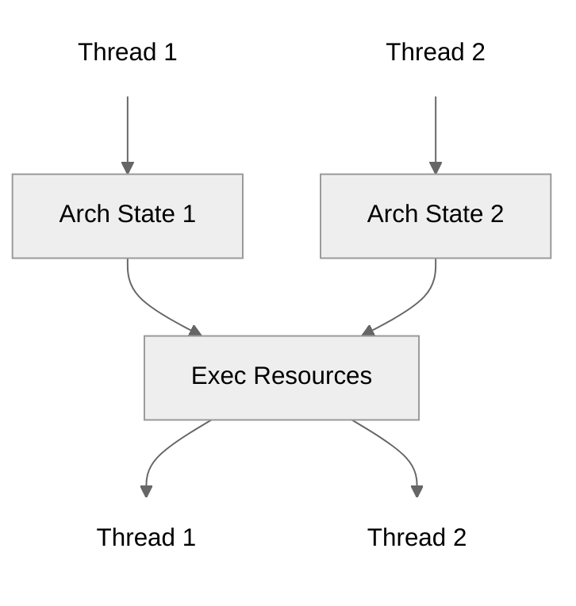
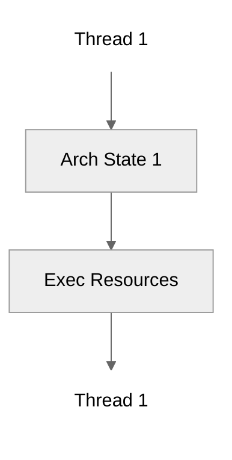
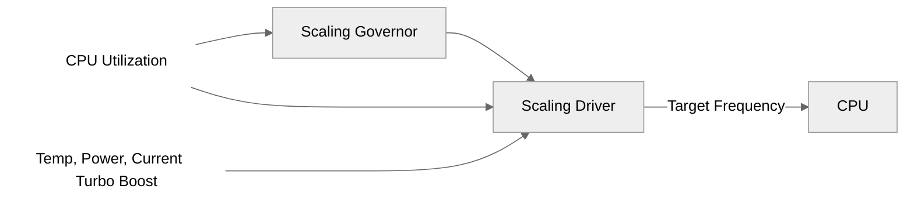
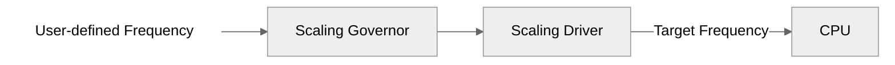

# Unused Slides

Slides that didn't make the final cut. May contain useful content for future talks.

---

<!-- _class: vcenter -->

# There will be dragons! 🐉

<span class="comment">
Ignore the slides after this. It's like a junkyard.
There might be some useful stuff to be salvaged there, but don't expect anything too polished.
</span>

<!-- Agenda -->

---

How to:

1. Control your benchmarking environment.
2. Design your benchmarks.
3. Interpret benchmark results.
4. Integrate benchmarks into your workflows.

<!-- Hypothesis testing slides -->

---

## Hypothesis test

**If t > critical value, reject the null hypothesis.**

---

## Hypothesis test

If t > critical value, reject the null hypothesis.

**Null hypothesis: no difference.**

---

## Hypothesis test

If t > critical value, reject the null hypothesis.

Null hypothesis: no difference.

**Alternative hypothesis: enough difference.**

---

## Hypothesis test

If t > critical value, reject the null hypothesis.

Null hypothesis: no difference.

Alternative hypothesis: enough difference.

**t, or t-statistic: difference/noise.**

---

## Hypothesis test

If t > critical value, reject the null hypothesis.

Null hypothesis: no difference.

Alternative hypothesis: enough difference.

t, or t-statistic: difference/noise.

**Critical value: threshold based on your tolerance for false positives.**

---

## Hypothesis test

If t > critical value, reject the null hypothesis.

Null hypothesis: no difference.

Alternative hypothesis: enough difference.

t, or t-statistic: difference/noise.

Critical value: threshold based on your tolerance for false positives.

**In practice, we use the p-value: <span class="hl">p < α</span>**

- **p-value:** probability of seeing this result if there's no real difference.
- **α:** false positive rate you're willing to tolerate.

---

<!-- _class: vcenter -->

```python
from scipy import stats

alpha = 0.05
t_stat, p_value = stats.ttest_ind(before, after)

if p_value < alpha:
    print("Statistically significant difference")
```

---

## Choosing α

<span class="hl">**α = 0.05**</span> (5%) is a common threshold for false positives.

Confidence level = 1 - α = 95%

---

## Choosing α

α = 0.05 (5%) is a common threshold for false positives.

Confidence level = 1 - α = 95%

**Trade-off**

- **Lower α (1%):** <span class="hl">Fewer false positives</span>, fewer detections.
- **Higher α (10%):** More false positives, <span class="hl">more detections</span>.

---

<!-- Why bare metal slides -->

## Why bare metal?

In virtualized environments, your benchmark competes with:

---

## Why bare metal?

In virtualized environments, your benchmark competes with:

- **Hypervisor overhead**: CPU cycles for virtualization

---

## Why bare metal?

In virtualized environments, your benchmark competes with:

- **Hypervisor overhead**: CPU cycles for virtualization
- **Noisy neighbors**: Other VMs on the same host

---

## Why bare metal?

In virtualized environments, your benchmark competes with:

- **Hypervisor overhead**: CPU cycles for virtualization
- **Noisy neighbors**: Other VMs on the same host
- **Resource contention**: Shared caches, memory bandwidth, I/O

---

## Why bare metal?

In virtualized environments, your benchmark competes with:

- **Hypervisor overhead**: CPU cycles for virtualization
- **Noisy neighbors**: Other VMs on the same host
- **Resource contention**: Shared caches, memory bandwidth, I/O

Bare metal eliminates these variables, giving you **full control** over the hardware.

---

## Why bare metal?

In virtualized environments, your benchmark competes with:

- **Hypervisor overhead**: CPU cycles for virtualization
- **Noisy neighbors**: Other VMs on the same host
- **Resource contention**: Shared caches, memory bandwidth, I/O

Bare metal eliminates these variables, giving you **full control** over the hardware.

<br>

_All kernel and CPU mitigations require bare metal access._

<!-- SMT slides -->

---

## What's SMT?

<div class="columns">

<div>
<center>



_SMT enabled_

</center>
</div>

<div>
<center>



_SMT disabled_

</center>
</div>

</div>

<!-- DFS slides -->

---

## What's DFS?

<center>



_DFS enabled_



_DFS disabled_

</center>

<!-- Coordinated omission slides -->

<span class="comment">Optional: Skip if short on time</span>

## What's coordinated omission?

When your load generator **waits** for each response before sending the next request:

---

## What's coordinated omission?

When your load generator **waits** for each response before sending the next request:

- Slow responses → fewer requests sent → latency appears lower
- The benchmark "coordinates" with the system to hide its own slowdowns

---

## What's coordinated omission?

When your load generator **waits** for each response before sending the next request:

- Slow responses → fewer requests sent → latency appears lower
- The benchmark "coordinates" with the system to hide its own slowdowns

**Solution:** Use load generators with **open-loop** mode (constant request rate regardless of response time).

<div class="bottom-citation">

_Gil Tene, "How NOT to Measure Latency" \[7\]_

</div>

<!-- Quote slides -->


<!-- _class: vcenter -->
<!-- footer: "How to Design Benchmarks" -->

<center>

_"All happy families are alike; each unhappy family is unhappy in its own way."_

</center>

<div style="text-align: right;">

— Leo Tolstoy, _Anna Karenina_

</div>

---

<!-- _class: vcenter -->

<center>

_"All happy <span class="replace"><span class="old">families</span><span class="new">benchmarks</span></span> are alike; each unhappy <span class="replace"><span class="old">family</span><span class="new">benchmark</span></span> is unhappy in its own way."_

</center>

<br>

<div style="text-align: right;">

— [Dmytro Yurchenko](https://www.linkedin.com/in/dmytro-y-/)

</div>
